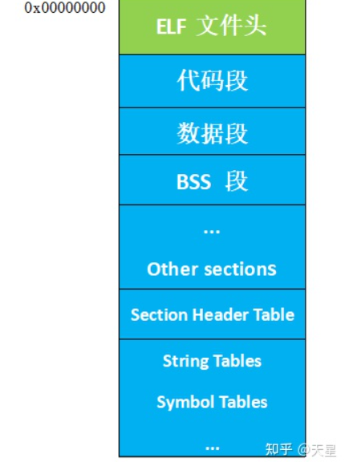
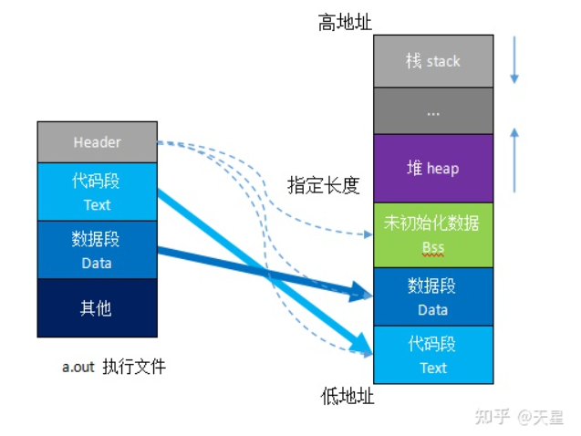

[Explore GOT and PLT using radare2 (ahageek.com)](http://ahageek.com/writer/posts/got-and-plt/index.html)

[Linux延迟绑定与安全防护机制 | Detective_LFY's Blog (detlfy.github.io)](https://detlfy.github.io/2021/09/29/Linux延迟绑定与安全防护机制/)

# ELF文件

## 1.ELF 文件结构大致如下图：

 ELF 文件包含三种类型：可重定位文件（*.o）、可执行文件、以及共享库（share library）。

三种文件格式从结构上来说基本一致，只是具体到每一个结构不同。

代码段（.text）是可执行指令的集合；数据段(.data)和 BSS 段(.bss)是数据的集合，其中.data 表示已经初始化的数据，.bss 表示未初始化的数据。

从可执行程序的角度来说，如果一个数据未被初始化，就不需要为其分配空间，所以.data 和.bss 的区别就是 .bss 并不占用可执行文件的大小，仅仅记录需要用多少空间来存储这些未初始化的数据，而不分配实际空间。

## **2 应用程序的组成**

### **2.1 组成**

从汇编语言角度，一个程序分为：

- 数据段
- 堆栈段
- 代码段
- 扩展段

站在高级语言，如 C 语言，一个程序分为如下段（当然还有其他段，这里列举主要的段）：

- 代码段
- 数据段
- BSS 段
- 栈
- 堆

我们可以看到一个可执行程序至少包含：**代码段 + 数据段 + BSS 段**

一般情况下，一个可执行二进制程序（在 linux 下为一个进程单元），在存储时（**没有加载到内存运行**），至少拥有三个部分，分别是代码段(text)、数据段(data)、和BSS 段。

这三个部分一起组成了可执行程序（可能还有其他的段，和平台相关）

当应用程序运行时（**运行态**），此时需要另外两个域：堆和栈。正在运行的程序：**代码段 + 数据段 + BSS 段 + 堆 + 栈**。

如图所示为可执行应用程序**存储态**和**运行态**的结构对照图。一个正在运行的 C 程序占用的内存区域分为代码段、数据段（初始化数据）、BSS 段（未初始化数据）、堆和栈 5 部分

### **2.2 内存管理**

在将应用程序加载到内存空间执行时，操作系统负责代码段、数据段和 BSS 段的加载，并在内存中为这些段分配空间。栈也由操作系统管理，不需要程序员显示的管理；堆段需要程序员自己管理，显示的申请和释放。

**动态分配**

在运行时执行动态分配。需要程序员显示管理，通过 malloc 申请，并且需要手动 free 掉，否则会造成内存泄漏。

**静态分配**

在编译时就已经决定好了分配多少 Text+Data+Bss+Stack（静态分配）。

静态分配的内存在进程结束后由系统释放（Text+Data）,Stack 上的数据则在退出函数后立即被销毁。

## **3 各段说明**

### **3.1 代码段**

代码段在内存中被映射为只读。它是由编译器在编译链接时自动计算的。通常是用来存放程序执行的指令。代码段输入静态内存分配。

### **3.2 数据段**

通常用来存放程序中已初始化的（非 0）全局变量和静态局部变量。数据段的起始位置由链接定位文件确认，大小在编译链接时自动分配。数据段属于静态内存分配

### **3.3 BSS 段**

bss 是英文 Block by Symbol 的简称。通常用来存放程序中未初始化和初始化为 0的全局变量的一块内存区域，在程序载入时由内核清零。数据段属于静态内存分配

### **3.4 堆**

堆保存函数内部动态分配（malloc 或 new）的内存，是另外一种用来保存程序信息的数据结构。

堆是先进先出（FIFO）数据结构。堆的地址空间是向上增加，即当堆上保存的数据越多，堆的地址越高。动态内存分配

注意：堆内存需要程序员手动管理内存，通常适用于较大的内存分配，如频繁的分配较小的内存，容易导致内存碎片化。

### **3.5 栈**

栈保存函数的局部变量（不包括 static 修饰的变量），参数以及返回值。是一种后进先出（LIFO）的数据结构。

在调用函数或过程后，系统会清除栈上保存的局部变量、函数调用信息及其他信息。

栈的另外一个重要特征是，它的地址空间 向下减少，即当栈上保存的数据越多，栈的地址越低。静态内存分配

注意，由于栈的空间通常比较小，一般 linux 程序只有几 M，故局部变量，函数入参应该避免出现超大栈内存使用，比如超大结构体，数组等，避免出现 stack overflow

# GOT表和PLT表

​		操作系统通常使用动态链接的方法来提高程序运行的效率。在动态链接的情况下，程序加载的时候并不会把链接库中所有函数都一起加载进来，而是程序执行的时候按需加载，如果有函数并没有被调用，那么它就不会在程序生命中被加载进来。这样的设计就能提高程序运行的流畅度，也减少了内存空间。而且现代操作系统不允许修改代码段，只能修改数据段，那么GOT表与PLT表就应运而生。