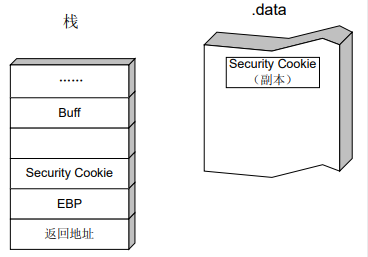

# 1.栈溢出（windows与linux原理类似）

## 		**栈溢出原理**：

在**函数调用**过程中向缓冲区**写入比缓冲区大**的数据**改变返回地址**，在函数调用**结束时将**返回**到改变的地址处**并开始执行。

## 函数调用

```
1.call   xxxx  
入栈返回地址 ，即call指令的下一个地址（rip执行）并且跳转到  指令 xxxx

2.然后开始栈帧调整
push ebp 			；保存旧栈帧的底部
mov ebp，esp   ；设置新栈帧的底部（栈帧切换）
sub esp，xxx    ；设置新的栈帧的顶部（抬高栈顶，为新栈帧开辟空间）

3.局部变量入栈

4.调用结束后
函数返回
保存返回值：通常将函数的返回值保存在寄存器 EAX 中

弹出当前栈帧，恢复上一个栈帧具体命令：
add	esp, xxx 	;降低栈顶，回收当前的栈帧			
pop ebp			;将上一个栈帧底部位置恢复到 ebp		
Retn			; 这条指令有两个功能	：
						a)弹出当前栈顶元素，即弹出栈帧中的返回地址。 至此栈帧恢复工作完成 。
						b)让处理器跳转到弹出的返回地址，恢复调用前的代码区
```


# 2.堆溢出（windows中，linux未尝试）

## 		**堆溢出利用的原理 ：**

​			**就是用精心构造的数据去**溢出下一个**堆块的**块首**，**改写**块首中的**前向指针**（flink）和**后向指针**（blink），然后**在分配、释放、合并等操作发生时**伺机获得一次**向内存任意地址写入任意数据的机会。


在使用堆时只需要做三件事情：**申请一定大小的内存，使用内存，释放内存。**

现代操作系统的堆数 据结构一般包括堆块和堆表两类。

## 1.堆块

出于性能的考虑，堆区的内存按不同大小组织成块，以堆块为单位进行标识，而不 是传统的按字节标识。一个堆块包括两个部分：块首和块身。

**块首**是一个堆块头部的几个字节， 用来标识这个堆块自身的信息，例如，本块的大小、本块空闲还是占用等信息；

**块身**是紧跟在 块首后面的部分，也是最终分配给用户使用的数据区


## 2.堆表：

​		**堆表**一般位于堆区的起始位置**，用于索引堆区中所有堆块**的重要信息，包括堆块的位置、堆块的大小、空闲还是占用等。堆表的数据结构决定了整个堆区的组织方式，是快速检索空闲块、保证堆分配效率的关键。堆表在设计时可能会考虑采用平衡二叉树等高级数据结构 用于优化查找效率。现代操作系统的堆表往往不止一种数据结构。


​		堆表只索引所有空闲态的堆块。其 中，最重要的堆表有两种：**空闲双向链表** Freelist（以下简称**空表**）和**快速单向链表** Lookaside（以下简称**快表**）

### 1．空表（空闲双向链表）

​		空闲堆块的块首中包含一对重要的指针，这对指针用于将空闲堆块组织成双向链表。按照**堆块的大小不同，空表总共被分为 128 条。**

 		**堆区一开始的堆表区中有一个 128 项的指针数组，**被称做空表索引（Freelist array）。该数组的**每一项包括两个指针**（共8字节大小），用于标识一条空表

(起始地址为申请堆块的偏移 0x0178处 ，即free[0]  ，0x0180 free[1]，以此类推)  

​		空表索引的第二项（free[1]）标识了堆中所有大小为 8 字节的空闲堆块， 之后每个索引项指示的空闲堆块递增 8 字节，例如，free[2]标识大小为 16 字节的空闲堆块，free[3] 标识大小为 24 字节的空闲堆块，free[127]标识大小为 1016 字节的空闲堆块。          **因此有： 空闲堆块的大小＝索引项（ID）×8（字节） free[0]除外**

​		空表索引**的第一项（free[0]）**所标识的空表相对比较特殊。这条双向 链表链入了所有**大于等于 1024 字节的堆块**（小于 512KB）。这些堆块按照各自的大小在零号空表中升序地依次排列下去.


### 2.快表（**快速单 向链表** ）

​             **快表是 Windows 用来加速堆块分配而采用的一种堆表**。

这里之所以把它叫做“快表”是因 为**这类单向链表中从来不会发生堆块合并**（其中的空闲块块首被设置为占用态，用来防止堆块合并）

​		**快表也有 128 条，组织结构与空表类似**，只是**其中的堆块**按照**单链表**组织。**快表总是被初始化为空**，而且**每条快表最多只有 4 个结点**，故很快就会被填满。


## 3.堆中的操作     (*重点)   

### 1．堆块分配

堆块分配可以分为三类：**快表分配、普通空表分配和零号空表（freelist[0]）分配。**

- **快表分配**

​		从快表中分配堆块比较简单，包括寻找到大小匹配的空闲堆块、将其状态修改为占用态、 把它从堆表中“卸下”、最后返回一个指向堆块块身的指针给程序使用。

- **普通空表分配**

​		普通空表分配时首先寻找最优的空闲块分配，若失败，则寻找次优的空闲块分配，即最小的能够满足要求的空闲块。

- **零号空表**

​			零号空表中按照大小升序链着大小不同的空闲块，故在分配时先从 free[0]反向查找最后一 个块（即表中最大块），看能否满足要求，如果能满足要求，再正向搜索最小能够满足要求的 空闲堆块进行分配   （零号空表要按照升序排列的原因）


- ​	堆块分配中的**“找零钱”现象**：

​				当空表中无法找到匹配的“最优”堆块时，一个稍大些的 块会被用于分配。这种**次优分配发生时，会先从大块中按请求的大小精确地“割”出一块进行 分配**，然后给**剩下的部分重新标注块首，链入空表**。这里体现的就是**堆管理系统的“节约”原 则**：买东西的时候用最合适的钞票，如果没有，就要找零钱，决不会玩大方。 

​		**快表只有在精确匹配时才会分配，故不存在“找钱”现象。**

### 2．堆块释放 

​		释放堆块的操作包括将堆块状态改为空闲，链入相应的堆表。所有的释放块都链入堆表的头部，分配的时候也先从堆表开始位置拿。

 另外需要强调，快表最多只有 4 项。

### 3．堆块合并 

​		当**堆管理系统发现两个空闲堆块彼此相邻**的时候，就会**进行堆块合并操作**。 堆块合并包括将两个块从空闲链表中“卸下”、合并堆块、调整合并后大块的块首信息（如 大小等）、将新块重新链入空闲链表。

# 3.保护机制

## windows

### 1. GS

**GS 编译选项**为每个函数调用增加了一些额外的数据和操作，用以**检测栈中的溢出**。

-  在所有函数调用发生时，向栈帧内压入一个额外的随机 DWORD，这个随机数被称做 “canary”，但如果使用 IDA 反汇编的话，您会看到 IDA 会将这个随机数标注为“Security  Cookie”。在本书的叙述中将用 Security Cookie 来引用这种随机数。

-  Security Cookie **位于 EBP 之前**，系统还将在**.data的内存区域**中存放一个 Security Cookie 的副本



- 当栈中发生溢出时，Security Cookie 将被首先淹没，之后才是 EBP 和返回地址。 

- 在**函数返回之前**，系统将**执行一个**额外的**安全验证操作**，被称做 **Security check**。 

- 在 Security Check 的过程中，系统将**比较栈帧中原先存放的 Security Cookie 和.data 中 副本的值**，如果两者**不吻合**，**说明**栈帧中的 Security Cookie 已被破坏，即**栈中发生了溢出**。

- **当检测到栈中发生溢出时**，系统将进入异常处理流程，函数不会被正常返回，ret 指令也不会被执行

  

### 2.  SafeSEH

​	（1）检查异常处理链是否位于当前程序的栈中，如图 11.1.3 所示。如果不在当前栈中，程 序将终止异常处理函数的调用

​	（2）检查异常处理函数指针是否指向当前程序的栈中，如图 11.1.3 所示。如果指向当前栈 中，程序将终止异常处理函数的调用。


（3）在前面两项检查都通过后，程序调用一个全新的函数 **RtlIsValidHandler()**，来对异常处 理函数的有效性进行验证

**RtlIsValidHandler()验证过程：**

首先，该函数判断异常处理函数地址是不是在加载模块的内存空间，如果属于加载模块的 内存空间，校验函数将依次进行如下校验：

​	（1）判断程序是否设置了 IMAGE_DLLCHARACTERISTICS_NO_SEH 标识。如果设置了 这个标识，这个程序内的异常会被忽略。所以当这个标志被设置时，函数直接返回校验失败。 

​	（2）检测程序是否包含安全 S.E.H 表。如果程序包含安全 S.E.H 表，则将当前的异常处理 函数地址与该表进行匹配，匹配成功则返回校验成功，匹配失败则返回校验失败。 

​	（3）判断程序是否设置 ILonly 标识。如果设置了这个标识，说明该程序只包含.NET 编译 人中间语言，函数直接返回校验失败。 

​	（4）判断异常处理函数地址是否位于不可执行页（non-executable page）上。当异常处理函数地址位于不可执行页上时，校验函数将检测 DEP 是否开启，如果系统未开启 DEP 则返回校验成功，否则程序抛出访问违例的异常。

​		如果异常处理函数的地址没有包含在加载模块的内存空间，校验函数将直接进行 DEP 相 关检测，函数依次进行如下校验：

​	（1）判断异常处理函数地址是否位于不可执行页（non-executable page）上。当异常处理函 数地址位于不可执行页上时，校验函数将检测 DEP 是否开启，如果系统未开启 DEP 则返回校 验成功，否则程序抛出访问违例的异常。 

（2）判断系统是否允许跳转到加载模块的内存空间外执行，如果允许则返回校验成功，否 则返回校验失败。

RtlIsValidHandler()函数的校验流程图


### 3. DEP

​		DEP 的基本原理是将数据所在内存页**标识为不可执行**，当程序溢出成功转入 shellcode 时， 程序会尝试在数据页面上执行指令，此时 CPU 就会抛出异常，而不是去执行恶意指令。


​	DEP 的**主要作用是阻止数据页（如默认的堆页、各种堆栈页以及内存池页）执行代码。** 微软从 Windows XP SP2 开始提供这种技术支持，根据实现的机制不同可分为：软件 DEP （Software DEP）和硬件 DEP（Hardware-enforced DEP）

​		软件 DEP 其实就是我们前面介绍的 SafeSEH，它的目的是阻止利用 S.E.H 的攻击，这种机 制与 CPU 硬件无关，Windows 利用软件模拟实现 DEP，对操作系统提供一定的保护。现在大 家明白为什么在 SafeSEH 的校验过程中会检查异常处理函数是否位于非可执行页上了吧。

​		硬件 DEP 才是真正意义的 DEP，硬件 DEP 需要 CPU 的支持，AMD 和 Intel 都为此做了设 计，AMD 称之为 No-Execute Page-Protection (NX)，Intel 称之为 Execute Disable Bit (XD) ，两者功能及工作原理在本质上是相同的。

​		**操作系统通过设置内存页的 NX/XD 属性标记，来指明不能从该内存执行代码。**为了实现 这个功能，需要在内存的页面表（Page T able）中加入一个特殊的标识位（NX/XD）来标识是 否允许在该页上执行指令。当该标识位设置为 0 里表示这个页面允许执行指令，设置为 1 时表 示该页面不允许执行指令。

### 4.ASLR

​		ASLR 包含了映 像随机化、堆栈随机化、PEB 与 TEB 随机化

**1．映像随机化** 

映像随机化是在 PE 文件映射到内存时，对其加载的虚拟地址进行随机化处理，这个地址是在**系统启动**时确定的，系统重启后这个地址会变化。

**2．堆栈随机化** 

​		这项措施是在程序运行时随机的选择堆栈的基址，与映像基址随机化不同的是堆栈的基址不是在系统启动的时候确定的，而是在**打开程序的时候确定**的，也就是说同一个程序任意两次运行时的堆栈基址都是不同的，进而各变量在内存中的位置也就是不确定的

**3．PEB 与 TEB 随机化**

​		PEB 与 TEB 随机化在 Windows XP SP2 中就已经引入了，微软在 XP SP2 之后不再使用固 定的 PEB 基址 0x7FFDF000 和 TEB 基址 0x7FFDE000，而是使用具有一定随机性的基址，这就 增加了攻击 PEB 中的函数指针的难度。

### 5.SEHOP

​		SEHOP（Structured  Exception Handling Overwrite Protection），这是一种比 SafeSEH 更为严厉的保护机制。

​		程序中的各 S.E.H 函数是以单链表的形式存放于栈中的，而在这个链表的末端是程序的默认异常处理，它负责处理前面 S.E.H 函数都不 能处理的异常。一个典型的 S.E.H 链如图 14.1.2 所示。


​		**SEHOP 的核心任务就是检查这条 S.E.H 链的完整性**，在程序转入异常处理前 SEHOP 会检查 S.E.H 链上最后一个异常处理函数是否为系统固定的终极异常处理函数。如果是，则说明这 条 S.E.H 链没有被破坏，程序可以去执行当前的异常处理函数；如果检测到最后一个异常处理 函数不是终极 BOSS，则说明 S.E.H 链被破坏，可能发生了 S.E.H 覆盖攻击，程序将不会去执 行当前的异常处理函数。

### 6.堆保护机制

1.  		**PEB random：**微软在 Windows XP SP2 之后不再使用固定的 PEB 基址 0x7ffdf000，而 是使用具有一定随机性的 PEB 基址。PEB 随机化之后主要影响了对 PEB 中函数的攻击，在 DWORD SHOOT 的时候，PEB 中的函数指针是绝佳的目标，移动 PEB 基址 将在一定程度上给这类攻击增加难度。
2. ​	    **safe Unlink**：微软改写了操作双向链表的代码，在卸载 free list 中的堆块时更加小心。 对照“堆溢 出利用（上）——DWORD SHOOT”中关于双向链表拆卸问题的描述，在 SP2 之前的链表拆卸操作类似于如下代码：

```
int remove (ListNode * node) 
{ 
 node -> blink -> flink = node -> flink; 
 node -> flink -> blink = node -> blink; 
 return 0; 
}
```

SP2 在进行删除操作时，将提前验证堆块前向指针和后向指针的完整性，以防止发生 DWORD SHOOT：

```
int safe_remove (ListNode * node) 
{ 
 if( (node->blink->flink==node)&&(node->flink->blink==node) ) 
 { 
 node -> blink -> flink = node -> flink; 
 node -> flink -> blink = node -> blink; 
 return 1; 
 } 
 else 
 { 
 链表指针被破坏，进入异常
 return 0; 
 } 
}
```

3. ​		**heap cookie**：与栈中的 security cookie 类似，微软在堆中也引入了 cookie，用于检测 堆溢出的发生。cookie 被布置在堆首部分原堆块的 segment table 的位置，占 1 个字节 大小，如图  所示。

   

**4.		元数据加密**：微软在 Windows V ista 及后续版本的操作系统中开始使用该安全措施。 块首中的一些重要数据在保存时会与一个 4 字节的随机数进行异或运算，在使用这些数据时候需要再进行一次异或运行来还原，这样我们就不能直接破坏这些数据了，以达到保护堆的目的。


## linux

https://www.cnblogs.com/Spider-spiders/p/8798628.html

### 1.**canary（栈保护）**

与windows中的GS原理相同

​		启用栈保护后，函数开始执行的时候会先往栈里插入cookie信息，当函数真正返回的时候会验证cookie信息是否合法，如果不合法就停止程序运行。攻击者在覆盖返回地址的时候往往也会将cookie信息给覆盖掉，导致栈保护检查失败而阻止shellcode的执行。在Linux中将cookie信息称为canary。

### 2.FORTIFY

​		fority非常轻微的检查，用于检查是否存在缓冲区溢出的错误。适用情形是程序采用大量的字符串或者内存操作函数，如memcpy，memset，stpcpy，strcpy，strncpy，strcat，strncat，sprintf，snprintf，vsprintf，vsnprintf，gets以及宽字符的变体。

### 3.**NX（no execute）**

与windows中的DEP原理相同

​	启用NX后，当程序溢出成功转入shellcode时，程序会尝试在数据页面上执行指令，此时CPU就会抛出异常，而不是去执行恶意指令。

### 4.**PIE（position-independent executables）**

与windows 中的ASLR原理相同

​		**位置独立的可执行区域**。对代码段（.text）、数据段（.data）、未初始化全局变量段（.bss）等固定地址的一个防护技术，如果程序开启了PIE保护的话，在每次加载程序时都变换加载地址。
​	这样使得在利用缓冲溢出和移动操作系统中存在的其他内存崩溃缺陷时采用面向返回的编程（return-oriented programming）方法变得难得多。

### 5.RELRO

RELRO（read only relocation）是一种用于加强对 binary 数据段的保护的技术，大概实现由linker指定binary的一块经过dynamic linker处理过 relocation之后的区域为只读，设置符号重定向表格为只读或在程序启动时就解析并绑定所有动态符号，从而减少对GOT（Global Offset Table）攻击。RELRO 分为 partial relro 和 full relro。

# 4.radare2 基本使用

分析文件步骤

首先查看保护机制    `rabin2 -I 文件名`	

在没有源代码的情况下，查看反汇编情况 `aas`    analyze syscall using dbg.reg   `a？`根据需要选择反汇编指令

`dcu `		代表 debug continue until   可用`dcu  main`执行到main函数

`VV`       进入图表

 


`rabin2 -I 文件名`			使用命令该命令查看 二进制信息，例如操作系统、语言、字节序、架构、缓解措施（canary、pic、nx）等。

`r2 megabeets_0x1 `  			运行

`ie`   （info >> entrypoint)    查看信息入口点

`i `    							命令（info）

` fs <flagspace>` 			选择一个标志空间并使用 f 打印它包含的标志。 要在一行中传递多个命令，我们可以使用分号（即 cmd1; cmd2; cmd3;...）。 例如··`fs imports; f`   标记了二进制文件使用的导入

` fs strings		`列出字符串标志空间

`iz` – 列出数据部分中的字符串
`izz` – 在整个二进制文件中搜索字符串

`axt` 命令用于“查找对该地址的数据/代码引用”  `axt @@ str.*` 			特殊运算符` @@ `就像一个 foreach 迭代器符号，用于在偏移列表上重复一个命令（参见 `@@?`），而` str.*` 是所有以` str. `开头的标志的通配符。这种组合有助于我们 不仅要列出字符串标志，还要列出函数名称、它们的使用位置和引用指令。

`alf`   (Analyze Functions List).	可查看radare2为我们标记了哪些其他函数。

`s `    寻找           例如    `s main`	来实现寻找 main函数

反汇编主函数 首先使用命令`s main` 找到主函数  在使用命令`pdf`(Print Disassemble Function)进行反汇编

`V` 进入可视模式屏幕。 使用	`p/P`	在模式之间切换。

`VV`可视化图表

`dc	 `		代表“**d**ebug **c**ontinue”

## 调试

 `-d` 标志启动调试器，并在加载二进制时添加 `-A` 标志进行分析。你可以通过使用 `db <function-name>` 命令在不同的地方设置断点，比如函数或内存地址。要查看现有的断点，使用 `dbi` 命令。一旦你放置了断点，使用 `dc` 命令开始运行二进制文件。你可以使用 `dbt` 命令查看堆栈，它可以显示函数调用。最后，你可以使用 `drr` 命令转储寄存器的内容：

```
$ r2 -d -A ./adder
```