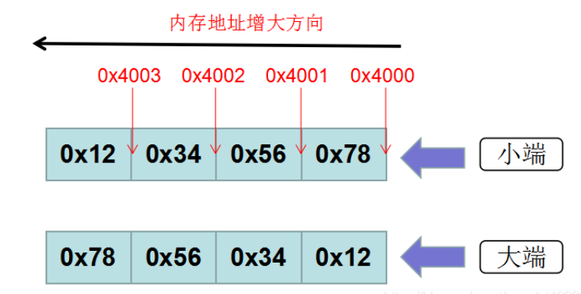

# 什么是大小端？如何确定大小端？

### 一、什么是大小端？

对于一个由2个字节组成的16位整数，在[内存](https://so.csdn.net/so/search?q=内存&spm=1001.2101.3001.7020)中存储这两个字节有两种方法：

一种是将低序字节存储在起始地址，这称为小端(little-endian)字节序；

另一种方法是将高序字节存储在起始地址，这称为大端(big-endian)字节序。

​		假如现有一32位int型数0x12345678，那么其MSB(Most Significant Byte，最高有效字节)为0x12，其LSB (Least Significant Byte，最低有效字节)为0x78，在CPU内存中有两种存放方式：（假设从地址0x4000开始存放)

总结：

大端是高字节存放到内存的低地址

小端是高字节存放到内存的高地址