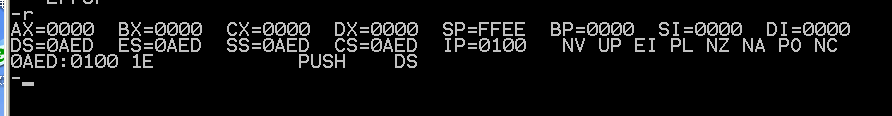

# 1寄存器

​		寄存器 32位寄存器有16个，分别是： 4个数据寄存器（EAX、EBX、ECX、EDX）。 2个变址和指针寄存器（ESI和EDI）；2个指针寄存器（ESP和EBP）。 6个段寄存器（ES、CS、SS、DS、FS、GS）。 1个指令指针寄存器（EIP）；1个标志寄存器（EFlags）。

## 1.1全程：

AH&AL＝`AX`(accumulator)：累加寄存器

BH&BL＝`BX`(base)：基址寄存器

CH&CL＝`CX`(count)：计数寄存器

DH&DL＝`DX`(data)：数据寄存器

`SP`（Stack Pointer）：堆栈指针寄存器

`BP`（Base Pointer）：基址指针寄存器

`SI`（Source Index）：源变址寄存器

`DI`（Destination Index）：目的变址寄存器

==**`DS`（Data Segment）：数据段寄存器**==

`ES`（Extra Segment）：附加段寄存器

==**`SS`（Stack Segment）：堆栈段寄存器**==

==`CS`    Code Segment）代码段寄存器==    

==`IP`（Instruction Pointer）：指令指针寄存器==

`溢出标志OF`：(Over flow flag) OV(1) NV(0)
`方向标志DF`：(Direction flag) DN(1) UP(0)
`中断标志IF`：(Interrupt flag) EI(1) DI(0)
`符号标志SF`：(Sign flag) NG(1) PL(0)
`零标志ZF`：(Zero flag) ZR(1) NZ(0)
`辅助标志AF`：(Auxiliary carry flag) AC(1) NA(0)
`奇偶标志PF`：(Parity flag) PE(1) PO(0)
`进位标志CF`：(Carry flag) CY(1) NC(0)

## 1.2常见使用

### 		CS和IP

​		CS和IP时两个最为关键的寄存器，它们指示了CPU当前要读取指令的地址。任意时刻，设cs中的内容为M，IP中的内容为N，CPU将从内存Mx16+N单元开始，读取一条指令并执行。

​		任意时刻，CPU将CS：IP指向的内容当作指令执行。

### call 和ret

  	 call和ret指令都是转移指令，他们都修改IP，或同时修改CS和IP。

ret指令会执行如下操作：

​	(IP)=((ss)*16+(sp))

​	(sp)=(sp)+2

汇编语法就是pop  ip

call指令，进行如下操作：
 (sp) = (sp) - 2

((ss)＊ 16 + (sp)) = (IP)  

(IP) = (IP) + 16位位移     //16位位移 = 标号处的地址 - call指令后的第一个字节的地址;