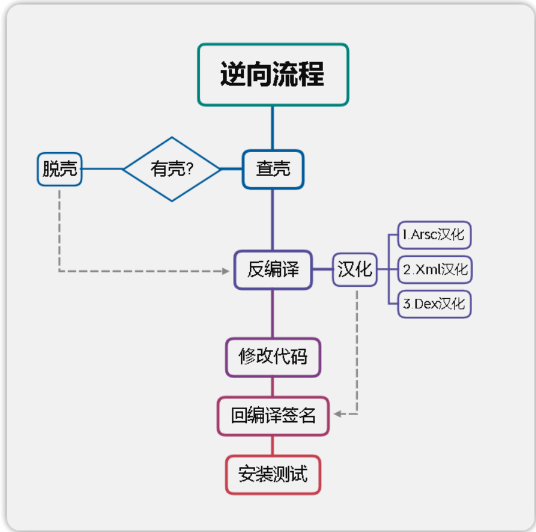

# Android手机逆向流程

## ARSC

​	解压缩 APK 文件之后，会看到一个叫做 `resources.arsc` 的文件，它的格式称之为 **ARSC 文件格式**

​	在打包过程中，但凡使用到资源的地方都是使用这个 ID 来代替的。ARSC 文件就是一个资源索引表，它可以帮助系统根据资源 ID 快速找到资源。

## Xml

## Dex

# 第一课

## 1.APK结构

apk 全称 Android Package，它相当于一个压缩文件，只要在电脑上将apk后缀改为zip即可解压

| 文件                    | 注释                                                         |
| :---------------------- | :----------------------------------------------------------- |
| assets目录              | 存放APK的静态资源文件，比如视频，音频，图片等                |
| lib 目录                | armeabi-v7a基本通用所有android设备，arm64-v8a只适用于64位的android设备，x86常见用于android模拟器，其目录下的.so文件是c或c++编译的动态链接库文件 |
| META-INF目录            | 保存应用的签名信息，签名信息可以验证APK文件的完整性，相当于APK的身份证(验证文件是否又被修改) |
| res目录                 | res目录存放资源文件，包括图片，字符串等等，APK的脸蛋由他的layout文件设计 |
| AndroidMainfest.xml文件 | APK的应用清单信息，它描述了应用的名字，版本，权限，引用的库文件等等信息 |
| classes.dex文件         | classes.dex是java源码编译后生成的java字节码文件，APK运行的主要逻辑 |
| resources.arsc文件      | resources.arsc是编译后的二进制资源文件，它是一个映射表，映射着资源和id，通过R文件中的id就可以找到对应的资源 |

## 2.双开及原理

双开：简单来说，就是手机同时运行两个或多个相同的应用，**例如**同时运行两个微信

| 原理               | 解释                                                         |
| :----------------- | :----------------------------------------------------------- |
| 修改包名           | 让手机系统认为这是2个APP，这样的话就能生成2个数据存储路径，此时的多开就等于你打开了两个互不干扰的APP |
| 修改Framework      | 对于有系统修改权限的厂商，可以修改Framework来实现双开的目的，例如：小米自带多开 |
| 通过虚拟化技术实现 | 虚拟Framework层、虚拟文件系统、模拟Android对组件的管理、虚拟应用进程管理 等一整套虚拟技术，将APK复制一份到虚拟空间中运行，例如：平行空间 |
| 以插件机制运行     | 利用反射替换，动态代{过}{滤}理，hook了系统的大部分与system—server进程通讯的函数，以此作为“欺上瞒下”的目的，欺骗系统“以为”只有一个apk在运行，瞒过插件让其“认为”自己已经安装。例如：VirtualApp |

## 3.汉化APK

汉化：使用专门的工具对外文版的软件资源进行读取、翻译、修改、回写等一系列处理，使软件的菜单、对话框、提示等用户界面显示为中文，而程序的内核和功能保持不变，这个过程即为软件汉化

**基本上字符串都是在arsc里，建议一键汉化，然后再润色。
少量没汉化到的字符串参考视频中的方法定位去逐个汉化。**

## 4.初识AndroidManifest.xml

AndroidManifest.xml文件是整个应用程序的信息描述文件，定义了应用程序中包含的Activity,Service,Content provider和BroadcastReceiver组件信息。每个应用程序在根目录下必须包含一个AndroidManifest.xml文件，且文件名不能修改。它描述了package中暴露的组件，他们各自的实现类，各种能被处理的数据和启动位置。

| 属性                               | 定义                                                     |
| :--------------------------------- | :------------------------------------------------------- |
| versionCode                        | 版本号，主要用来更新，例如:12                            |
| versionName                        | 版本名，给用户看的，例如:1.2                             |
| package                            | 包名，例如：com.zj.52pj.demo                             |
| uses-permission android:name=""    | 应用权限，例如：android.permission.INTERNET 代表网络权限 |
| android:label="@string/app_name"   | 应用名称                                                 |
| android:icon="@mipmap/ic_launcher" | 应用图标路径                                             |
| android:debuggable="true"          | 应用是否开启debug权限                                    |

## 任务流程

### 1.双开

apk共存  修改包名`（即修改了应用的签名信息，若应用有签名校验 可能会出现错误） ` 安装两个相同应用

### 2.汉化

mt搜索功能  勾选高级搜索（相当于全局搜索，会在应用中所有文件进行搜索）

# 第二课

## 1.什么是JVM、Dalvik、ART

==JVM==        是JAVA虚拟机，运行JAVA字节码程序
==Dalvik==    是Google专门为Android设计的一个虚拟机，Dalvik有专属的文件执行格式dex(Dalvik executable)
==Art==         (Android Runtime)相当于Dalvik的升级版，本质与Dalvik无异

## 2.smali及其语法

smali是Dalvik的寄存器语言，smali代码是dex反编译而来的。

关键字

| 名称        | 注释                       |
| :---------- | :------------------------- |
| .class      | 类名                       |
| .super      | 父类名，继承的上级类名名称 |
| .source     | 源名                       |
| .field      | 变量                       |
| .method     | 方法名                     |
| .register   | 寄存器                     |
| .end method | 方法名的结束               |
| public      | 公有                       |
| protected   | 半公开，只有同一家人才能用 |
| private     | 私有，只能自己使用         |
| .parameter  | 方法参数                   |
| .prologue   | 方法开始                   |
| .line xxx   | 位于第xxx行                |

数据类型对应

| smali类型    | java类型                          | 注释                 |
| :----------- | :-------------------------------- | :------------------- |
| V            | void                              | 无返回值             |
| Z            | boolean                           | 布尔值类型，返回0或1 |
| B            | byte                              | 字节类型，返回字节   |
| S            | short                             | 短整数类型，返回数字 |
| C            | char                              | 字符类型，返回字符   |
| I            | int                               | 整数类型，返回数字   |
| J            | long （64位 需要2个寄存器存储）   | 长整数类型，返回数字 |
| F            | float                             | 单浮点类型，返回数字 |
| D            | double （64位 需要2个寄存器存储） | 双浮点类型，返回数字 |
| string       | String                            | 文本类型，返回字符串 |
| Lxxx/xxx/xxx | object                            | 对象类型，返回对象   |

常用指令

| 关键字       | 注释                                                   |
| :----------- | :----------------------------------------------------- |
| const        | 重写整数属性，真假属性内容，只能是数字类型             |
| const-string | 重写字符串内容                                         |
| const-wide   | 重写长整数类型，多用于修改到期时间。                   |
| return       | 返回指令                                               |
| if-eq        | 全称equal(a=b)，比较寄存器ab内容，相同则跳             |
| if-ne        | 全称not equal(a!=b)，ab内容不相同则跳                  |
| if-eqz       | 全称equal zero(a=0)，z即是0的标记，a等于0则跳          |
| if-nez       | 全称not equal zero(a!=0)，a不等于0则跳                 |
| if-ge        | 全称greater equal(a>=b)，a大于或等于则跳               |
| if-le        | 全称little equal(a<=b)，a小于或等于则跳                |
| goto         | 强制跳到指定位置                                       |
| switch       | 分支跳转，一般会有多个分支线，并根据指令跳转到适当位置 |
| iget         | 获取寄存器数据                                         |

其余指令可用语法工具查询

定位方法：搜索弹窗关键字、抓取按钮id

修改方法：修改判断、强制跳转、修改寄存器的值

## 3.寄存器

在smali里的所有操作都必须经过寄存器来进行:本地寄存器用v开头数字结尾的符号来表示，如v0、 v1、v2。 参数寄存器则使用p开头数字结尾的符号来表示，如p0、p1、p2。特别注意的是，p0不一定是函数中的第一个参数，在非static函数中，p0代指“this"，p1表示函数的第一个 参数，p2代表函数中的第二个参数。而在static函数中p0才对应第一个参数(因为Java的static方法中没有this方法）

# 第三课

## 1.安卓四大组件

| 组件                           | 描述                                                         |
| :----------------------------- | :----------------------------------------------------------- |
| Activity(活动)                 | 在应用中的一个Activity可以用来表示一个界面，意思可以理解为“活动”，即一个活动开始，代表 Activity组件启动，活动结束，代表一个Activity的生命周期结束。一个Android应用必须通过Activity来运行和启动，Activity的生命周期交给系统统一管理。 |
| Service(服务)                  | Service它可以在后台执行长时间运行操作而没有用户界面的应用组件，不依赖任何用户界面，例如后台播放音乐，后台下载文件等。 |
| Broadcast Receiver(广播接收器) | 一个用于接收广播信息，并做出对应处理的组件。比如我们常见的系统广播：通知时区改变、电量低、用户改变了语言选项等。 |
| Content Provider(内容提供者)   | 作为应用程序之间唯一的共享数据的途径，Content Provider主要的功能就是存储并检索数据以及向其他应用程序提供访问数据的接口。Android内置的许多数据都是使用Content Provider形式，供开发者调用的（如视频，音频，图片，通讯录等） |

## 2.Activity生命周期

| 函数名称    | 描述                                                         |
| :---------- | :----------------------------------------------------------- |
| onCreate()  | 一个Activity启动后第一个被调用的函数，常用来在此方法中进行Activity的一些初始化操作。例如创建View，绑定数据，注册监听，加载参数等。 |
| onStart()   | 当Activity显示在屏幕上时，此方法被调用但此时还无法进行与用户的交互操作。 |
| onResume()  | 这个方法在onStart()之后调用，也就是在Activity准备好与用户进行交互的时候调用，此时的Activity一定位于Activity栈顶，处于运行状态。 |
| onPause()   | 这个方法是在系统准备去启动或者恢复另外一个Activity的时候调用，通常在这个方法中执行一些释放资源的方法，以及保存一些关键数据。 |
| onStop()    | 这个方法是在Activity完全不可见的时候调用的。                 |
| onDestroy() | 这个方法在Activity销毁之前调用，之后Activity的状态为销毁状态。 |
| onRestart() | 当Activity从停止stop状态恢进入start状态时调用状态。          |

